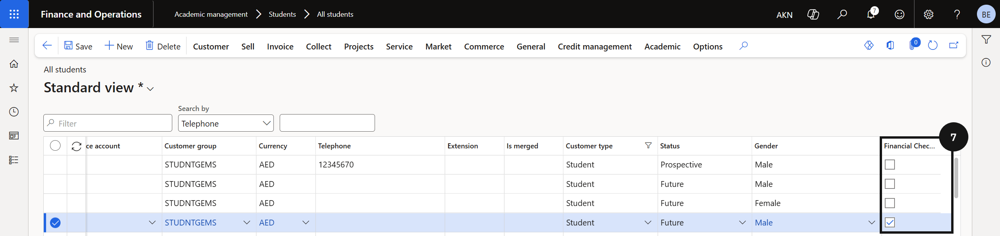

# Clear Financial Check Overrides

At the start of a new year or after a promotion process, overrides set in the previous cycle need to be cleared.

1. Add the Financial check override column to the list view

   From the **FNO dashboard**, open **Modules ▸ Academic Management**, expand **Students**, and click **All students**. Right-click any column header and select **Insert field**. Search for and add the **Financial check override** field, then click **Update**. The column displays as a checkbox and persists in the view for future use.

2. Identify and clear overrides

   Filter or sort the list by the **Financial check override** column to display only students with an active override. Clear overrides using one of the following methods:

   - **Individual** — uncheck the **Financial check override** checkbox directly in the list for each student.
   - **Bulk via Excel** — click **Export to Excel**, clear the override values in the exported file, then import the file back into the system.

