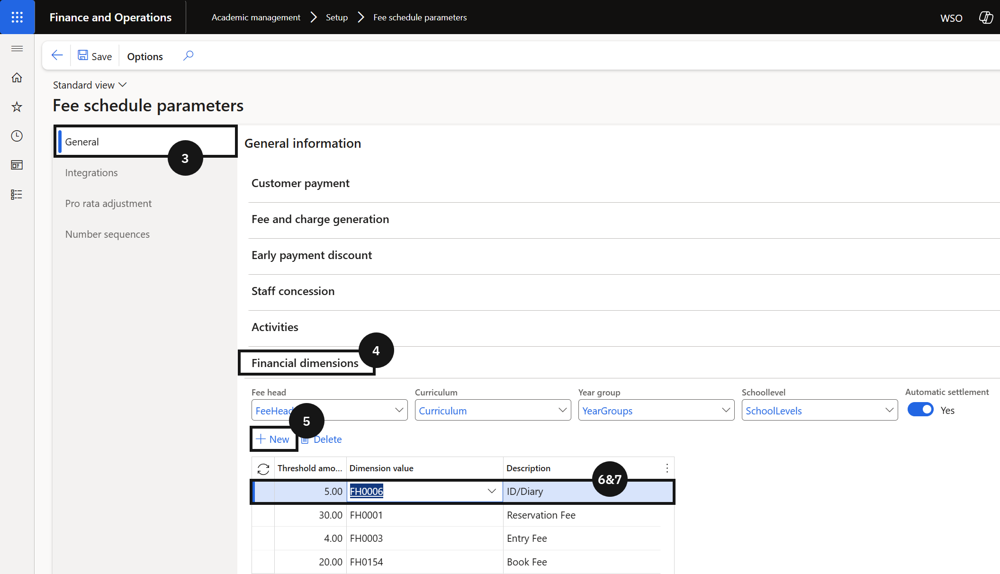

# Configure Financial Check Threshold

The financial check setup defines the outstanding fee balance threshold that the Student Management System uses when polling Finance & Operations to determine whether a student is cleared for re-enrolment. Thresholds are configured by fee head (dimension value), so different acceptable balance limits can apply to different fee types.

1. Open Fee schedule parameters

   From the **FNO dashboard**, open **Modules ▸ Academic Management**, expand **Setup**, and click **Fee schedule parameters**. Open the **General** tab (③) and expand the **Financial dimension** section (④).

2. Add thresholds by fee head

   Click **+ New** (⑤) and complete the following for each fee type that requires a balance check (⑥-⑦):

   - **Threshold amount** — enter a monetary amount. If a student's outstanding balance for this fee head is at or above this amount, they will not receive financial clearance.
   - **Dimension value** — select the fee head from the dropdown. The Description field defaults to the selected fee head.

   Repeat for each fee head that requires a threshold.

   

3. Save

   Click **Save**. When the Student Management System requests re-enrolment clearance, it checks the student's outstanding balance by fee head against each configured threshold. A student is financially cleared only if their balance for each configured fee head is below the threshold.

