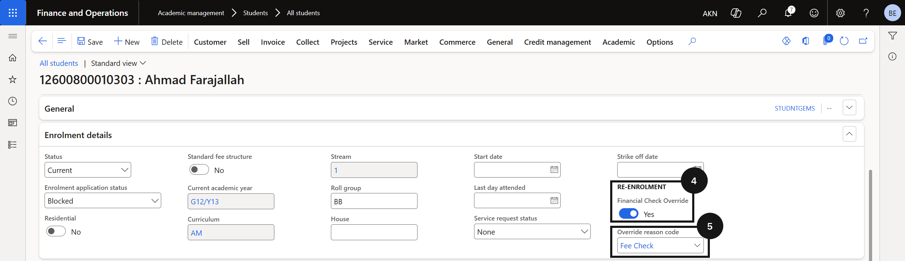

# Override the Financial Check for Re-Enrolment

Where a payment arrangement is in place and the school does not want to block a student's re-enrolment, an authorised user can apply a financial check override on the student's record. This override applies to the next system poll only — it does not permanently exempt the student from the financial check.

1. Open the student record

   From the **FNO dashboard**, open **Modules ▸ Academic Management**, expand **Students**, and click **All students**. Open the relevant student record.

2. Apply the override

   In the **Enrolment details** tab, set the **Financial check override** toggle to **Yes** (④) and select an **Override reason code** from the dropdown (⑤). Reason codes are configured by the school (e.g., *Fee check — payment plan in place*) and create an audit record for the override. Click **Save**.

   On the next system poll, the student will be excluded from the financial check and their status will update to **Re-enrolment open**.

   
