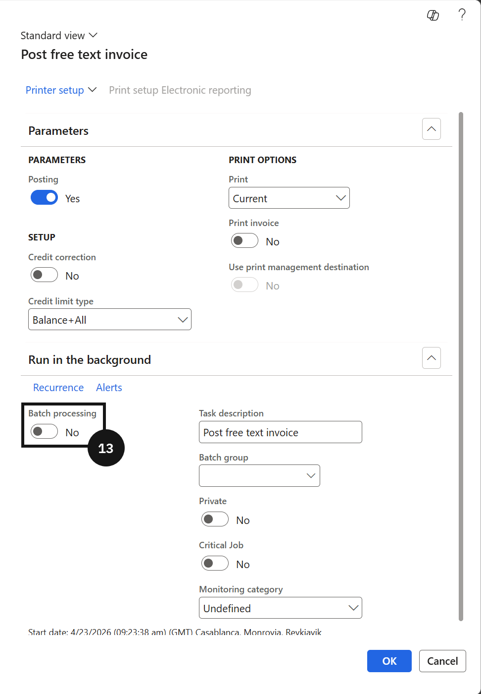

# Raise a Transfer Certificate Fee

When a student withdraws and requests a transfer certificate, a free text invoice is raised using the pre-configured TCINV template. In a live environment, this step is triggered by a request from the customer experience team.

1. Create the invoice from template

   From the **FNO dashboard**, open **Modules ▸ Accounts receivable**, expand **Invoices**, and click **All free text invoices**. Click **New from template** in the toolbar, select **TCINV** in the **Template** field, and complete the following:

   - **Customer account** — enter or select the fee payer.
   - **Create invoice by using the default values from** — select *Free text invoice template*.

   Click **OK**. The template pre-populates the invoice line with the transfer certificate fee configuration.

2. Complete invoice details

   In the **Description** field, enter a description. Scroll down and expand the **Line details** tab, then open the **Financial dimension line** tab. Set the financial dimensions — select **Curriculum**, **School Levels**, and **Year Group**. The **Fee Head** field is auto-populated from the free text invoice template setup.

3. Post the invoice

   Click **Post**, set **Batch processing** to *No*, click **OK**, and close the page.

