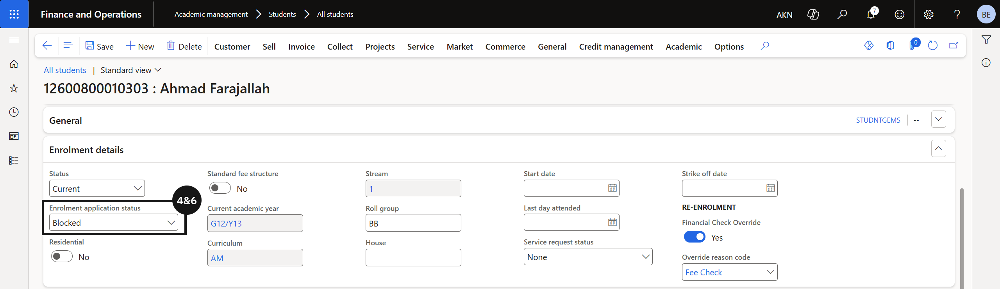

# Blocking Due to Fee Outstanding

During re-enrolment, the Student Management System automatically polls D365 F&O to check each student's outstanding balance. Students whose balance exceeds the configured threshold are blocked from re-enrolment — the Student Management System is notified not to issue their invitation until the balance is cleared. The threshold is configured in fee schedule parameters and must be set before the polling period begins.

1. Identify the blocked student

   From the **FNO dashboard**, open **Modules ▸ Academic Management**, expand **Students**, and click **All students**. Open the relevant student record and confirm their status shows as **Blocked**. Students whose balance exceeds the configured threshold are automatically assigned a Blocked status and the Student Management System is notified to prevent re-enrolment progression.

2. Arrange payment and confirm clearance

   Contact the family to arrange payment of the outstanding balance. Once payment is received and the system polls again, confirm the student's status has updated to **Re-enrolment open**.

