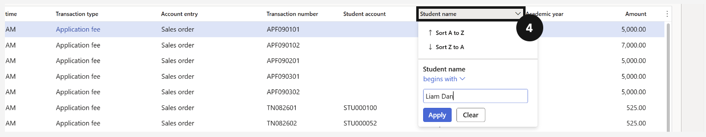

# View Student Enrolment Dates

Before a student can be promoted, their academic enrolment record must show both the current grade and the next academic year record. The next academic year record is automatically received from the Student Management System after eligibility and finance checks are completed.

> **Note:** Do not edit the Academic enrolments table directly in Dynamics 365 — records are managed upstream by the Student Management System.

1. Open the student record

   From the **FNO dashboard**, open **Modules ▸ Academic Management**, expand **Students**, and click **All students**. Open the relevant student record.

2. Confirm enrolment status and academic records

   Confirm the student's enrolment status shows as **Re-enrolment open**. Select **Academic** from the Action Pane and click the **Academic enrolments** tab. Verify the table shows both the student's current grade/year and the next grade/year for promotion.

