# Collections

Collections covers the full range of payment processing and receipt management functions available to finance staff. It includes setting up and applying payment plans for instalment arrangements, processing in-person payments through over-the-counter and cashier receipt forms, handling post-dated cheques and overpayments, scheduling bulk credit card payment runs, processing advance payments with discount calculations, managing early payment discounts, issuing fee refunds of credit balances, recording miscellaneous receipts, reversing posted payments, and handling dishonoured cheques.

---

#### Setup
Payment schedules allow the school to offer fee payers the option of paying invoices in instalments rather than as a single lump sum. Setting this up involves two steps. First, a payment schedule is created in Accounts Receivable, defining the allocation method, the number of payments, and the frequency. Second, the schedule is linked to a payment option in Academic Management, giving it a name, description, and active date range. Once both are in place, the payment plan can be applied to individual fee payer accounts, and the system will split their invoices into the configured instalments accordingly.

---

## Create a New Payment Plan

1. From the **FNO dashboard**, open **Modules** ▸ **Accounts receivable**.
2. Expand **Payments setup** and click **Payment schedules**.
3. Click **New** to create a new payment schedule entry.
4. Enter a **unique code**.
5. Enter a **description** for the payment schedule.
6. Complete the following fields to create the payment schedule:
   - Assign the payment **Allocation**.
   - Assign the timeline in the **Payments per field**.
   - Enter the frequency in the **Change field**.
   - Enter the **Number of payments**.
7. Click **Save**.

---

## Apply the Payment Schedule to Payment Plans

1. From the **FNO dashboard**, open **Modules** ▸ **Academic Management**.
2. Expand **Setup**, then expand **Payment option setup**.
3. Click **New** to create a new payment option.
4. Complete the following fields to create they payment option:
   - Select the required **payment plan**.
   - Enter an **Option name**.
   - Enter a **Description**.
   - Set the **Start and End dates** for the payment plan.
5. Click **Save**.

---

## Apply Payment Plan to Fee Payer

1. From the **FNO dashboard**, open **Modules** ▸ **Academic management**.
2. Expand **Fee payer** and click **All fee payers**.
3. Choose and **click** on a Fee payer account.
4. Expand **Payment defaults** section.
5. Click **edit** from the toolbar.
6. Choose a **Method of payment**.
7. Select the **Payment plan** dropdown and choose the payment plan to apply.
8. Click **Academic** tab from toolbar.
9. Click **Update payment plan**.
10. Choose 1 or more invoices checkbox.
11. Click **Preview** in bottom left to review the split invoices.
12. Review the details and click **Back**.
13. Click **Yes** in bottom left, if prompted. 
14. Click **Save** and go back.
15. Open **Modules** ▸ **Academic management** ▸ **Payment Plan**.
16. Click **Payment plan details**.
17. Change the filter to **Show All** if needed.
20. Select the invoice.
21. Click **Invoices** from toolbar.
22. Click **Split invoice details** from toolbar to verify the invoices were split correctly.
23. Click **Cancel** to exit. 

---

## Cancel or Amend Payment Plans

>**Note**: The payment plan must already be assigned to the fee payer account before it can be removed. 
1. From the **FNO dashboard**, open **Modules** ▸ **Academic management**.
2. Expand **Fee payer** and click **All fee payers**.
3. Choose and **click** on a customer account number.
4. To cancel the payment plan, click **Edit** in **Payment defaults**.
5. Clear the **Payment plan** field.
6. Click **Save**.
7. Click **Academic** tab from toolbar.
8. Click **View payment plan** under **Payment plan**.
9. Choose 1 or more invoices checkbox.
10. Amend the payment plan by clicking **Merge invoice** in toolbar.
    >**Note**: *Merge invoice is only available when split invoices already exist.*
11. Click **Yes** to confirm.
12. Click **Save**.

---

## View Payment Plan Details

>**Note**: This process attaches a payment plan to a student record and splits eligible fee invoices into installments in Dynamics 365 Finance. This is used when a fee payer requests to pay student fees in multiple installments.

1. From the **FNO dashboard**, open **Modules** ▸ **Academic management**.
2. Expand **Students** and click **All Students**.
3. In student record, open **Payment defaults**.
4. Select the required **Payment plan**.
5. Click **Save**.
6. Click **Academic** tab from the toolbar.
7. Click **Update payment plan** under **Payment plan**.
8. Select the open invoices that need to be split.
   >**Note**: *Only unpaid invoices can be split.*
9. Click **Preview**.
10. Update the due dates in the available fields, if changes are needed.
11. Click **Yes** to confirm and split invoice into installments.
12. Go back to **Academic** ▸ **Payment plan** ▸ **View payment plan**.
13. Change the filter to **Show Approved** to review the split invoices.
14. Click **Invoices** to view all invoices linked to the payment plan.
17. Click **Split invoice detail** to view the installment breakdown for each invoice.
    
---

#### In-Person (Over-the-Counter)
 
Over-the-counter payment processing is used when a fee payer makes a payment directly at the school, rather than through an online or automated channel. Staff can process a payment using the Over the Counter Payment form — selecting the fee payer, entering the amount, and allocating it to open invoices — or through the Cashier Receipt form when paying outstanding overdue invoices directly. The Cashier Receipt form also supports post-dated cheque entry, allowing staff to record a cheque with a future maturity date, link it to a specific student account, and capture issuing bank details before posting. If a payment exceeds the invoice total, the system records the excess as an advance. Once posted, the system generates a journal reference number and provides the option to print or email a receipt to the fee payer, completing the transaction with a full audit trail.

---

## Over-the-Counter Processing

1. From the **FNO dashboard**, open **Modules** ▸ **Accounts receivable**.
2. Expand **Payments** and click **Over the counter payment**.
3. Click **Create New Customer Payment** in the toolbar.
4. A new form will appear for entering payment details. Choose the **fee payer** from the list.
5. The system displays the fee payer's name and any open invoices.
6. Select the **payment method** (e.g., credit card or cash) from the Method of payment column.
7. Enter the **amount being paid** and select the **payment account** where the funds will be deposited.
8. **Mark the invoices** the payment should be applied to.
   > Note: *If the payment exceeds the invoice total, the extra amount is recorded as an advance.*
9. The system automatically checks the **Pay in Advance** box if there is an unallocated amount.
10. Click **Post** to finalise the entry.
11. The system generates a **unique journal number** for reference.
12. A dialog box appears asking if you want to **print and/or email** the receipt. Select your options and click **OK**.
13. The system prints the receipt and/or sends it to the fee payer's email as specified.

---

## Over-the-Counter Processing – Outstanding Payment
 
1. From the **FNO dashboard**, open **Modules** ▸ **Accounts receivable**.
2. Expand **Payments** and click **Cashier receipt**.
3. Click **+ Cashier receipt** to create a new cashier receipt journal.
4. Enter the **student account** in the **Customer** field.
> **Note:** *The description field auto-populates based on the selected account but can be edited if required.*
 
5. In the invoices panel on the right, tick the **invoice** to be paid.
6. Select the **method of payment** from the **Method of payment** dropdown.
7. Enter the **outstanding amount**.
8. Enter a value in the **Payment reference** field if required.
9. Click **Post** in the Action Pane.
10. Enable the **Print receipt** toggle.
11. Click **OK** to generate and issue the posted payment receipt.
    

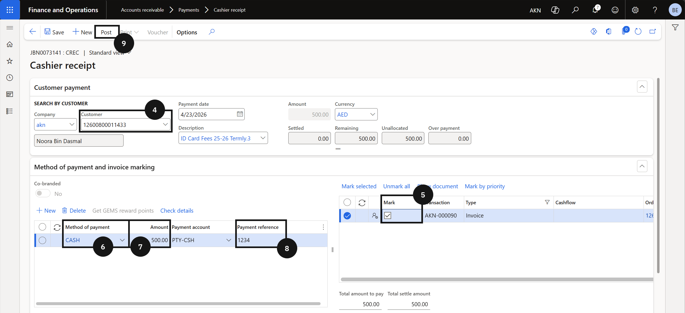

---

## Over-the-Counter Processing – Pre-Admission Fees Payment
 
1. From the **FNO dashboard**, open **Modules** ▸ **Accounts Receivable**.
2. Expand **Payments** and click **Cashier receipt**.
3. Click **+ Cashier receipt** in the toolbar to create a new cashier receipt journal.
4. In the **Customer** field, select the student account for the pre-admission fee payment.
5. In the **Description** field, enter a description for the transaction.
6. Open the **Pre-admission fee** section, tick the **Mark** checkbox to select the prepayment invoice.
7. In the **Method of payment** field, select the payment method.
8. In the **Amount** field, enter the pre-admission fee amount.
9. Click **Post**.
10. Enable the **Print receipt** toggle to preview the posted receipt.
11. Click **OK** to post the journal.
    

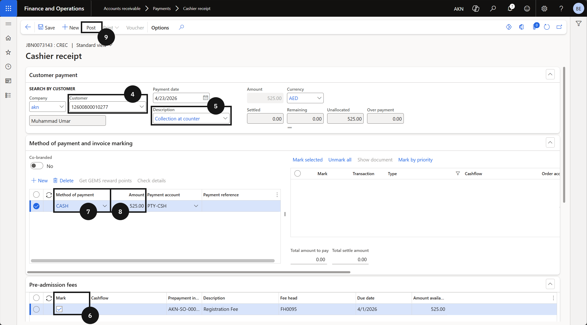

---

## Over-the-Counter Processing – Activity Invoice Payment

1. From the **FNO dashboard**, open **Modules** ▸ **Accounts Receivable**.
2. Expand **Payments** and click **Cashier receipt**.
3. Click **+ Cashier receipt** to create a new cashier receipt journal.
4. In the **Customer** field, select the student account for the activity fee payment.
5. In the **Description** field, enter a description for the transaction.
6. In the invoices panel on the right, tick the **Mark** checkbox to select the activity fee invoice.
7. In the **Method of payment** field, select the payment method.
8. In the **Amount** field, enter the activity fee amount.A
9. In the **Payment reference** field, enter the payment reference, if required.
10. Click **Post** in the Action Pane.
11. Enable the **Print receipt** toggle to preview the posted payment receipt.
12. Click **OK** to post the journal.

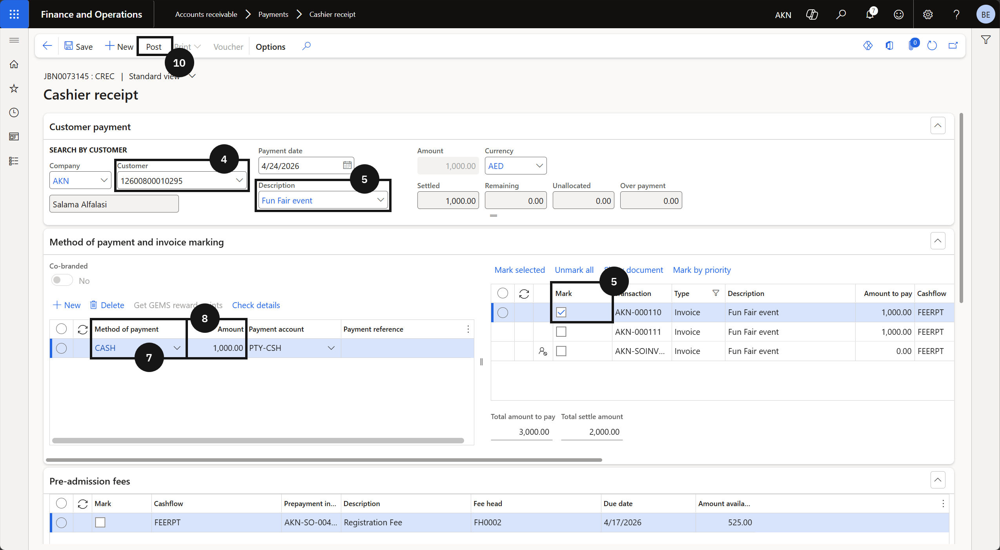

---

## Over-the-Counter Processing – Over Payment
 
1. From the **FNO dashboard**, open **Modules** ▸ **Accounts receivable**.
2. Expand **Payments** and click **Cashier receipt**.
3. Click **+ Cashier receipt** to create a new cashier receipt journal.
4. Enter the **student account** in the **Customer** field.
5. In the invoices panel on the right, tick the **invoice** to be paid.
6. In the **Method of payment** field, select the payment method.
7. In the **Amount** field, enter an amount greater than the invoice total.
8. Enter a value in the **Payment reference** field if required.
> **Note:** *After saving, the excess amount appears in the **Overpayment** field. This allows the cashier to review and correct the amount before posting if the overpayment was entered in error.*
 
9. Click **Post**.
10. Enable the **Print receipt** toggle if a copy of the posted receipt is required.
11. Click **OK**.
    

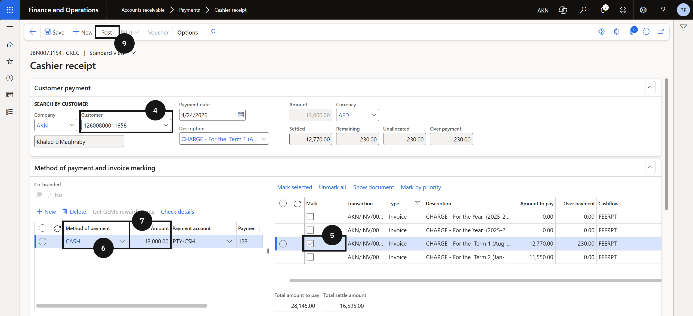

---

## Over-the-Counter Processing – Post-Dated Cheques
 
1. From the **FNO dashboard**, open **Modules** ▸ **Accounts receivable**.
2. Expand **Payments** and click **Cashier receipt**.
3. Click **+ Cashier receipt** to create a new cashier receipt journal.
4. In the **Customer** field, select the student account.
5. On the right-hand side, mark the **payment** to be applied.
6. In the **Method of payment** field, select *Cheque*.
7. Enter the **amount** in the amount field.
8. Enter the payment reference in the **Payment reference** field if required.
9. Click **Check details**.
> **Note:** *The Check details button becomes active only when the Method of payment is set to Cheque.*
 
10. Enable the **Postdated check** toggle.
11. Enter the cheque maturity date in the **Maturity date** field.
12. Enter the date the cheque was received in the **Received date** field.
13. Enter the cheque number in the **Check number** field.
14. Enter the name of the cashier who collected the cheque in the **Cashier** field.
15. Select the customer's bank in the **Issuing bank** field.
16. Click **OK**.
17. Click **Post** on the action pane.
18. Enable the **Print receipt** toggle to print the posted payment receipt.
19. Click **OK** to post the journal.

 

---

#### Scheduled Credit Card
Scheduled credit card processing is used to handle bulk fee payments via credit card for a defined period. Staff create a new customer payment journal, generate a payment proposal for the relevant date range and payment method, and review the invoices returned. Selected invoices are transferred to the payment journal, and the system then requests authorisation from the payment service provider. If authorisation is successful, the transactions are posted and marked as complete. If any lines fail authorisation, they are removed automatically and must be manually reviewed or retried. This process allows the school to efficiently manage large volumes of credit card payments in a single batch.

---

## Scheduling Credit Card Payments

1. From the **FNO dashboard**, open **Modules** ▸ **Accounts receivable**.
2. Expand **Payments** and click **Customer payment journal**.
3. Click **New** to create a new journal and **select the appropriate journal name**.
4. Click **Lines** in the toolbar.
5. Click the **Payment Proposal** button, then select **Create Payment Proposal**.
6. In the dialog box, enter the **date range** for due invoices (e.g., January 1 to January 31).
7. Set the **Method of payment** to credit card (CC).
8. Set the **Summarised payment date**.
9. Click **OK** to run the proposal.
10. The system displays all invoices due within the selected period. Select the invoices to be paid, or leave unmarked to select all.
11. Click **Create Payments** to transfer selected invoices to the payment journal.
    > Note: *Delete any lines with zero or debit amounts, as only payable invoices should remain.*
12. Enter the **Payment reference** as required.
13. Click the **Functions** button in the toolbar, then select **Generate Credit Card Payments**.
    > Note: *The system requests authorisation from the service provider. If successful, the status changes to Approved; if not, a failure message appears, unauthorised lines are deleted and must be manually retired or reviewed.*
14. Once authorisation is received, click **Post**.
    > Note: *The system confirms posting, and the Post button becomes inactive. All transactions are now posted and complete.*

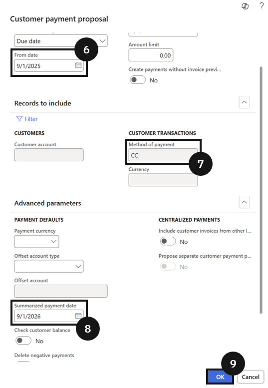

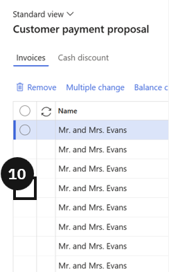

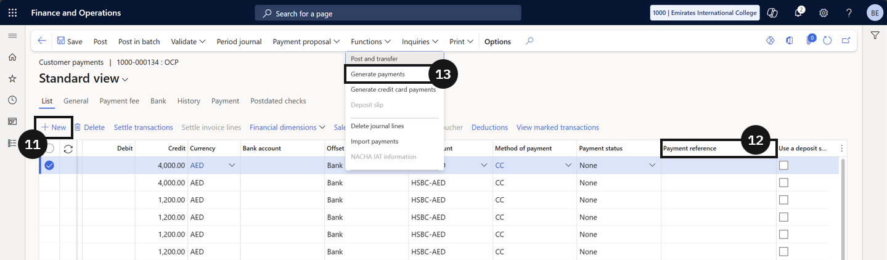

---

#### Advance Payment

Advance payment allows a school to collect fees for future term invoices before they are due, with the system automatically calculating and applying any applicable advance discounts based on configured discount policies. Staff process advance payments through the Cashier Receipt form, selecting the co-branded payment method to trigger the discount calculation. Once posted, the system generates a prepayment invoice for each term covered by the payment, alongside the receipt journal. A simulation tool is also available for staff to calculate the projected discount for a given amount without completing a payment transaction — this is useful when a fee payer wants to understand their discount entitlement before committing to payment.

---

## Advance Payment

> **Note:** *Before processing an advance payment, confirm that the Advanced Discount Policy is configured for the relevant fee and charge interval, and that a proforma invoice has already been generated for the student.*

1. From the **FNO dashboard**, open **Modules** ▸ **Accounts Receivable**.
2. Expand **Payments** and click **Cashier Receipt**.
3. Click **+ Cashier reciept** to create a new cashier receipt.
4. Enter the **student account** in the **Customer** field.
5. Under **Method of Payment**, enable the **Co-branded** option.
6. Select the **co-branded method of payment** from the dropdown.

> **Note:** *Enabling the Co-branded option activates the Calculate Discount button. Advance discounts can only be applied when this option is selected.*

7. Enter the **total amount** to be paid.

> **Note:** *To pay 3 terms, enter the combined total of all 3 term invoice amounts. To pay 2 terms, enter the combined total of 2 term invoice amounts. The discount rate applied is determined by the number of terms the entered amount covers.*

8. Enter the **sale order number** in the **Payment Reference** field.
9. Click **Calculate Discount**.

> **Note:** *The system automatically populates the discount rate and discount amount based on the Advanced Discount Policy configuration for the number of terms being paid.*

10. Click **Post**.
11. Select your **receipt options** and click **OK**.

> **Note:** *The system generates and posts one prepayment invoice per term covered by the payment. For example, paying 3 terms generates 3 prepayment invoices. Posted transactions include 1 receipt/payment transaction and one prepayment invoice per term paid.*

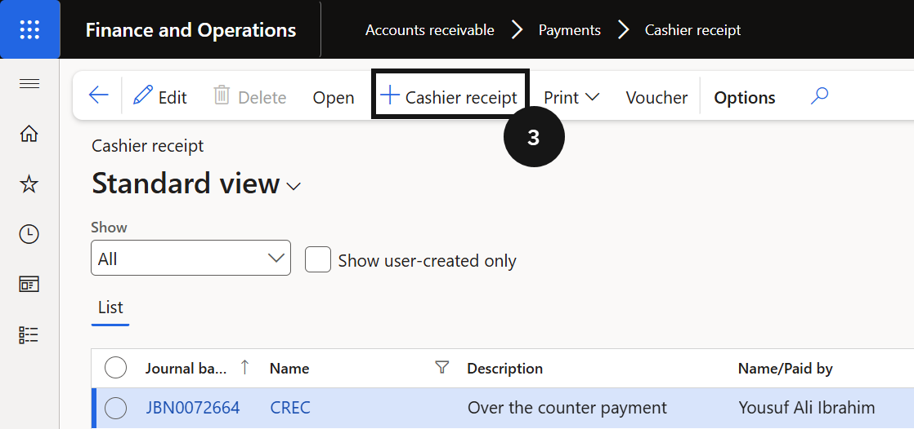

---

## Advance Discount Simulation

1. From the **FNO dashboard**, open **Modules** ▸ **Academic Management**.
2. Expand **Inquiry and Report**, **Co-branded transactions** and click **Advanced Discount Policy**.
3. Enter the **student account** in the **Customer** field.
4. Select the **co-branded method of payment** from the **Method of Payment** dropdown.
5. Enter the **amount** to simulate.

> **Note:** *Enter the actual proforma invoice amount, or a dummy amount large enough to cover the proforma invoice, to see the applicable discount. Enter a single term amount, a two-term total, or the full period total to compare discount rates.*

6. Click **Simulate**.

> **Note:** *The system displays the discount rate and amount that would apply if the fee payer made an advance payment for the entered amount. This tool does not create a transaction — it is for calculation and agreement purposes only.*

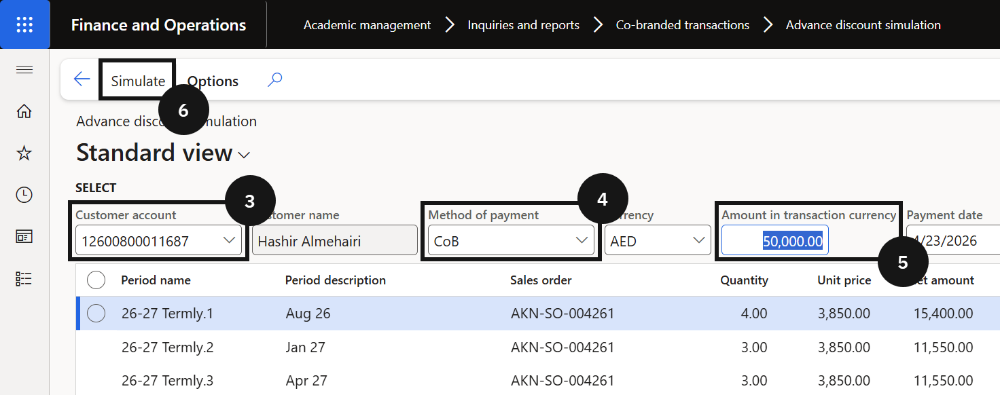

---

## Configure Early Payment Discount Setup

1. From the **FNO dashboard**, open **Modules** ▸ **Accounts receivable**.
2. Expand **Payment setup** and click **Cash discounts**.
3. Click **New** to add a discount.
4. Enter the **Cash Discount** code.
5. Enter a **Description**.
6. Specify either a **Discount Percentage or a Fixed Discount Amount**.
7. Assign the **Main Account** where the discount will be posted.
8. Click **Save**.

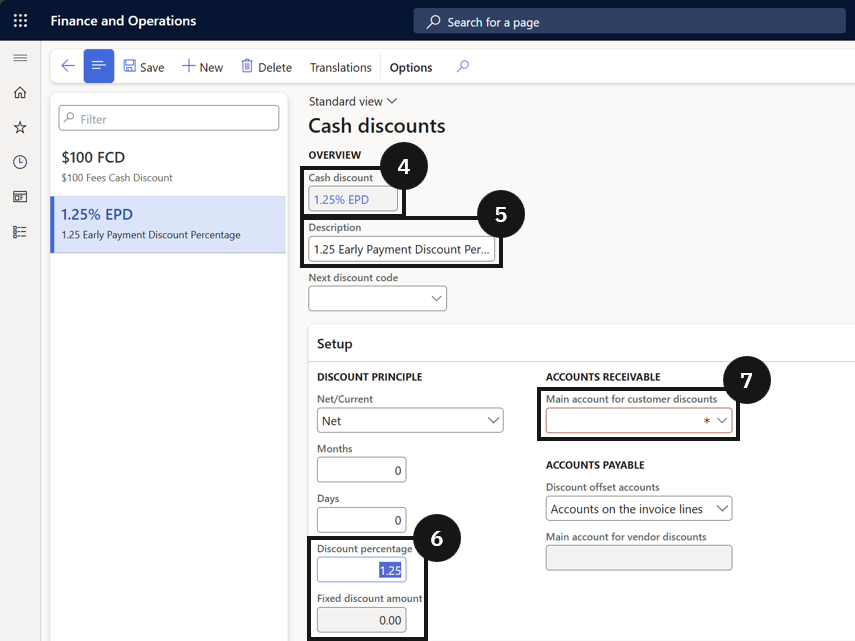

---

## Assigning Early Payment Discounts to Products / Fees

1. From the **FNO dashboard**, open **Modules** ▸ **Product information management**.
2. Expand **Products** and click **Released products**.
3. Select a relevant **fee item** (e.g., tuition, music lesson, sport class).
4. Under the **Sell** section, assign the relevant discount code and percentage or amount using the **Early payment discount** dropdown.
5. Click **Save**.

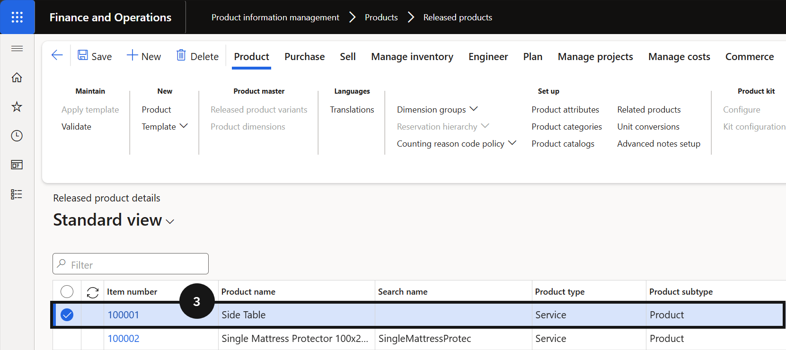

---

## Bulk Updating Early Payment Discounts on Invoices

1. From the **FNO dashboard**, open **Modules** ▸ **Academic Management**.
2. Expand **Periodic tasks** and click **Update early payment discount**.
3. Enter the **date range** for invoices to include, or **filter for a single fee payer** or run for all.
4. Set the **Early payment date** for the selected invoices.
5. Click **OK** to run the process.
6. Go to **Accounts receivable** ▸ **Invoices** ▸ **Open Customer Invoices**.
7. Filter by **fee payer and/or date range** to confirm discounts and due dates are updated on invoices.

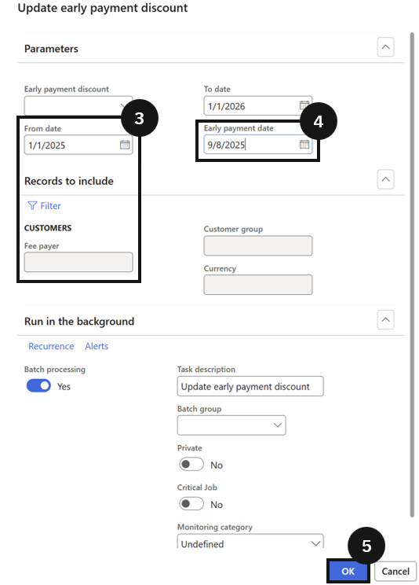

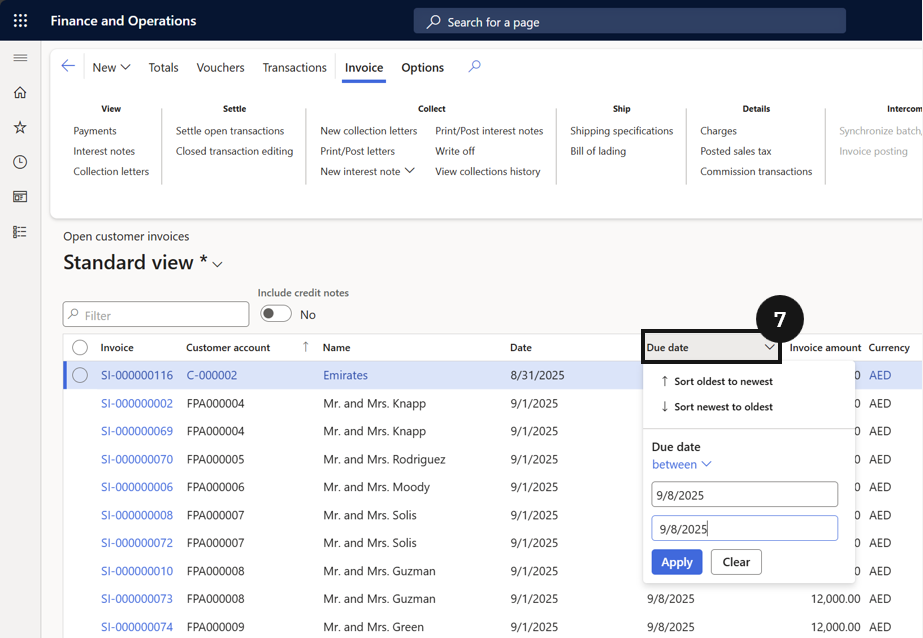

---

## Controlling Discount Eligibility Based on Payment

1. From the **FNO dashboard**, open **Modules** ▸ **Academic Management**.
2. Expand **Setup** and click **Fee schedule parameter**.
3. Choose whether to enable or disable **Early payment discount eligibility**.
4. Click **Save**.
   > Note: *If unchecked, the discount applies even if only one invoice is paid. If checked, the discount applies only if all due invoices are paid together.*

---

## Processing Payments with Discounts

1. From the **FNO dashboard**, open **Modules** ▸ **Accounts receivable**.
2. Expand **Payments** and click **Customer payment journal**.
3. Click **New** to create a payment journal.
4. Select the **Name**.
5. Click **Lines** in the toolbar.
6. Select the **fee payer**.
7. Click **Settle transactions**.
8. Set the **payment date before the discount due date**.
9. Settle the invoice(s) by clicking **OK**.
   > Note: *The system automatically applies the discount, reducing the payable amount.*
10. Enter **Payment reference**.
11. **Post** the journal.
12. Check the **voucher** to confirm the discount was posted.
    > Note: *Click the three dots in the toolbar and choose All related vouchers to see the discount amount.*

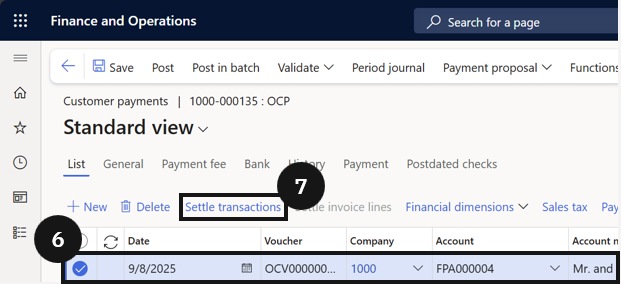

---

#### Fee Refunds

Fee refunds of credit balances are processed when a student's account holds an excess credit that needs to be returned to the fee payer. Staff create a customer payment journal using the refund journal type, select the student account, identify the credit invoice through the settle transactions function, and configure the financial dimensions for both the fee head and the offset bank account. Once the journal is posted — or approved through workflow if applicable — the refund is recorded against the student's account and the credit balance is cleared.

---

## Fee Refunds of Credit Balances

1. From the **FNO dashboard**, open **Modules** ▸ **Accounts receivable**.
2. Expand **Payments** and click **Customer payment journal**.
3. Click **New**.
4. In the **Name** field, select *Customer refund journal*.
5. Click **Lines**.
6. Complete the required fields.
7. Click **Settle transactions**.
8. Locate and select the credit invoice to be refunded.
9. Select the **Mark** checkbox.
10. Click **OK**.
11. Open **Financial dimensions**, click **Account**
12. In the **Fee head** value field, select the fee head to refund.
13. Click **OK**.
14. Open **Financial dimensions**, click **Offset account**.

> **Note:** *The offset account represents the bank account side of the refund transaction and should reflect the CashFlow refund account configured for your school.*

15. Click **OK**.
16. Click **Post**.
    - If a workflow is active, submit the journal for approval and follow the workflow process until the journal is approved before posting.

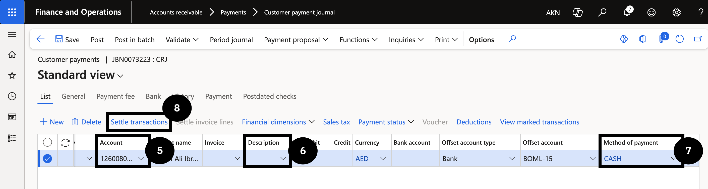

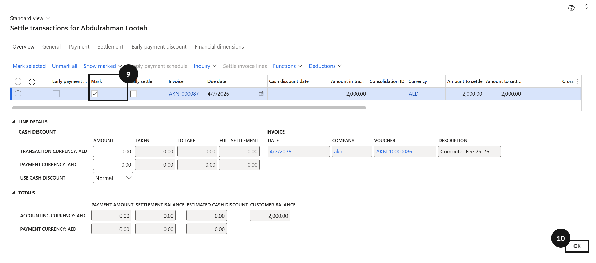

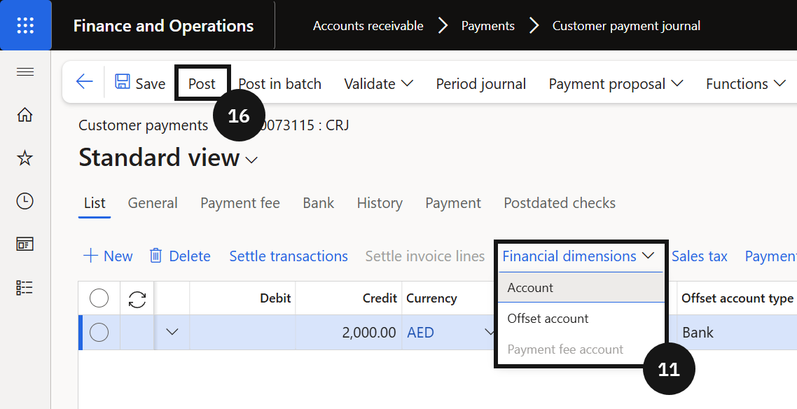

---

## Collection Letter Setup 

1. From the **FNO dashboard**, open **Modules** ▸ **Credit and Collections**.
2. Expand **Collection letters** and click **Set up collection letter sequence**.
3. Click **+Add** to create a new collection letter.
4. Select **Collection letter code** from the dropdown(e.g., First Reminder).
5. Enter a **Description**. 
6. Enter the number of **Days** after the invoice due date when the letter should be sent.
  >**Note**: *This value controls when the reminder is triggered after the due date*.
7. Repeat steps 3-6 to add additional letters (e.g., Second Reminder, Suspension Letter).
8. Enter any additional fees or fines if applicable.
  >**Note**: *Leave fields blank if no fees or fines apply*.
9. Click **Save**.
10. Go to **Modules** ▸ **Credit and Collections**.
11. Expand **Forms** and click **Form notes**.
11. In Form note section, enter the note text to print on each collection letter.
   - includes information for student account, student ID, and outstanding amount if needed.
   - adjust tone and urgency based on the reminder stage.
12. Click **Save**.

---

## Generate 3 letters and the Suspension 
**WIP**

1. Go to **Credit and collections ▸ Collection letter ▸ Create collection letters**.
2. Select the transaction types to include.
3. **Tip:** Use the invoice filter or customer filter to limit the results to a specific student or customer.
4. Select the **Collection letter type**.
5. Enter the **Collection letter date**.
6. Enter the **Customer ID** or **student account**, if you want to generate letters for one account only.  
   **Condition:** Leave this field blank to generate letters for all eligible accounts.
7. Click **OK** to generate the collection letter.
8. Go to **Credit and collections ▸ Collection letter ▸ Review and process collection letters**.
9. Select the newly created collection letter.
10. Review the letter details, including overdue amounts and related transactions.
11. Click **Print** and select **Collection letter note** to generate the report.
12. Enter the required posting or cutoff date when prompted.
13. Review the printed letter for accuracy.
14. Click **Post** to finalize the collection letter.
15. Repeat the process for the next letter in the sequence, if required.  
    **Condition:** Use the next collection letter code and the correct date according to your escalation schedule.

---

## Excel Upload for Excluding Students

---

## Fee Advances Ageing

---

## Generate Fee Statements

1. From the **FNO dashboard**, open **Modules** ▸ **Academic Management**.
2. Expand **Inquiries and reports**, then expand **Fee payer statement report**.
3. Click **Fee payer account statement**.
4. Enter the **start and end dates** for the statement period you want to generate.
5. Decide whether to show **payment options** on the statement by selecting the appropriate option.
6. Open the **Records to include** section and click **Filter** to choose the specific account for which you want to generate the statement.
7. Click **OK** to generate the statement for the selected account.
8. Review the completed statement and distribute it to the fee payer as required.

---

#### Miscellaneous Receipts

The miscellaneous receipt function allows cashiers to record incoming payments that are not linked to a specific student invoice or customer account. This is used when funds are received for ad hoc items such as event fees, lost property charges, or sundry income. The cashier enters the payment details, selects a fee type to determine the correct general ledger coding, and posts the transaction. An optional receipt can be printed at the time of posting.

---

## Cashier Receipt — Miscellaneous Receipt

1. From the **FNO dashboard**, open **Modules** ▸ **Accounts Receivable**.
2. Expand **Payments** and click **Miscellaneous receipt**.
3. Click **+ Miscellaneous receipt**.
4. Enter the cashier name in the **Received From** field.
5. Select the **Method of payment**.
6. Enter the **Amount**.

> **Note:** *The **Payment account** populates automatically based on the selected method of payment.*

7. Enter the **Payment reference**.
8. Select a **Fee type** from the dropdown.

> **Note:** *The **Account**, **Description**, and **Sales tax group** fields populate automatically based on the selected fee type.*

9. Enter the amount in the **Credit** field.
10. Click **Post**.
11. Enable the **Print receipt** toggle if a printed receipt is required.
12. Click **OK** to complete the transaction.

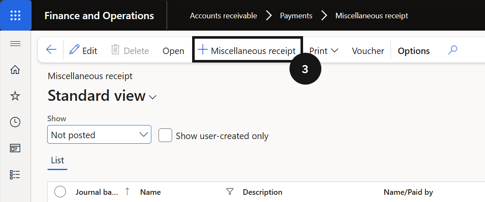

---

#### Cancel Receipt

Cancel Receipt is used when a posted customer payment needs to be reversed. Staff locate the student's transaction record, initiate a reversal, and select a cancellation reason. The system reverses the original payment entry and updates the student's account accordingly.

---

## Cancel Receipt

1. Navigate to **Modules** ▸ **Academic Management** ▸ **Students** ▸ **All students**.
2. Filter the list to locate the required student.
3. Click **Customer** on the Action Pane.
4. Click **Transactions**.
5. Select the transaction.
6. Click **Reverse**.
7. Click **Cancel payment**.
8. Select the **reversal date** in the date picker.

> **Note:** *The reversal date cannot be set prior to the original posting date.*

9. Select a value from the **Reason code** dropdown.
10. Click **OK**.

---

#### Cheque Returns

When a customer cheque is returned due to insufficient funds, staff must reverse the original cheque payment, apply the NSF (non-sufficient funds) fee, and post the resulting accounting entries. The process begins by locating the dishonoured payment in the student's transaction history, reversing it using the NSF payment option, entering a reason code, and then posting the system-generated journal. Once posted, the reversal and associated fee entries are recorded against the student's account.

---

## Cancel Cheque – Insufficient Funds

1. Navigate to **Modules** ▸ **Academic Management** ▸ **Students** ▸ **All students**.
2. Filter for the student using the **Account** column filter or by name.
3. Click **Transactions**.
4. In **Customer transactions**, locate the **Cheque Payment** line for the dishonoured cheque.
5. Select the payment row.
6. Click **Reverse** in the action ribbon.
7. Select **NSF payment** from the dropdown.

> **Note:** *Selecting NSF payment triggers the reversal of the original cheque transaction and initiates the NSF fee entry.*

8. Click **OK** on the confirmation prompt.
9. In the **Cancel payment** window, select a **Reason code**.

> **Note:** *Select the reason code that matches the return reason, for example, *Cheque returned – insufficient funds*.*

10. Click **OK**.
11. Navigate to **Modules** ▸ **Accounts receivable** ▸ **Payments** ▸ **Customer payment journal**.
12. Enable **Show user-created only**.
13. Locate and select the journal created for the NSF reversal.
14. Click **Lines**.
15. Click **Post**.

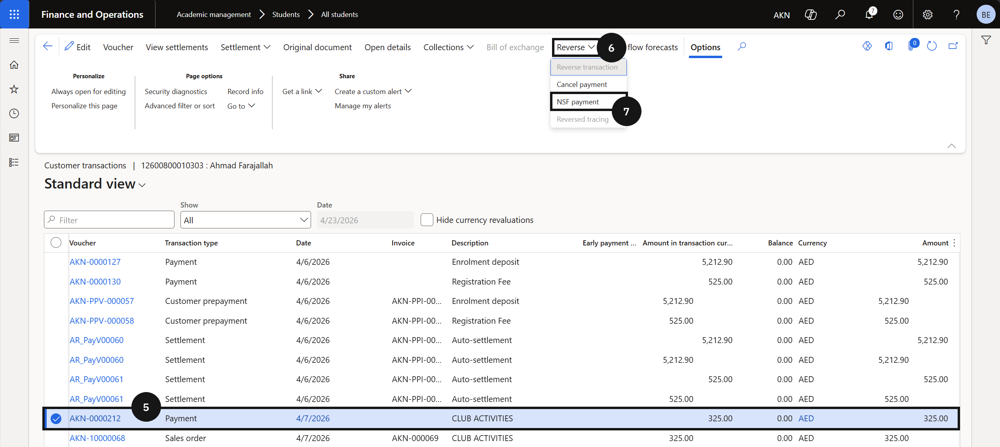

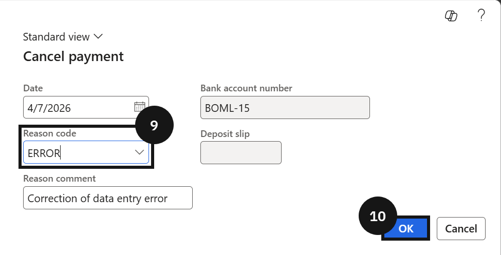

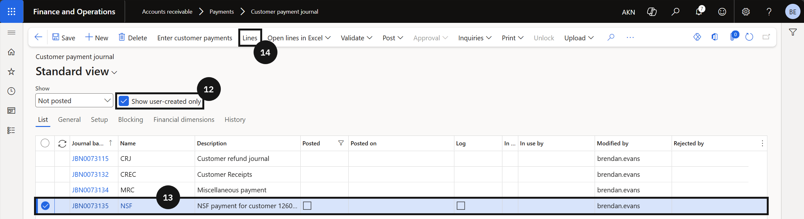

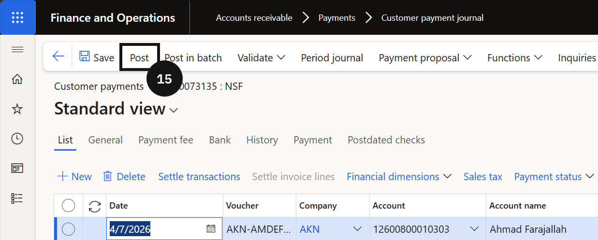
