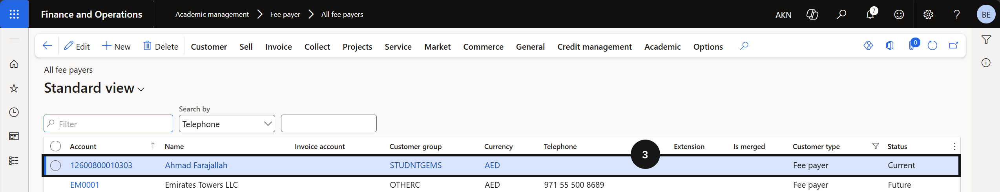
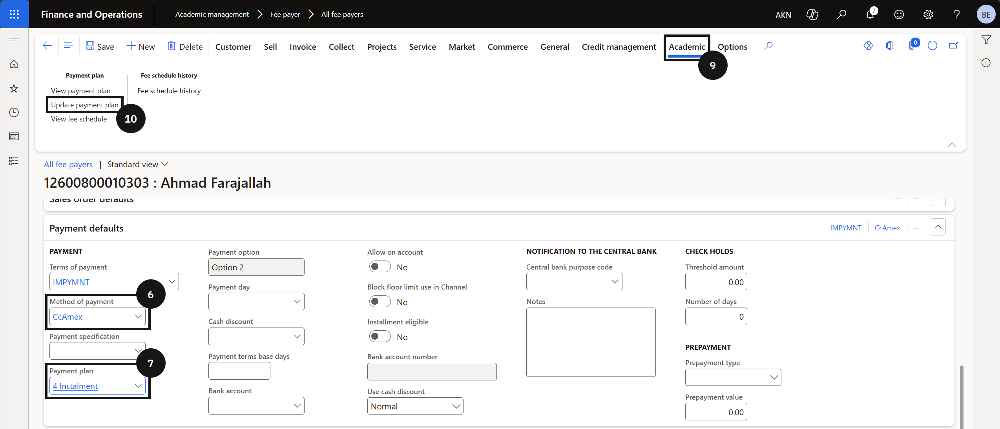
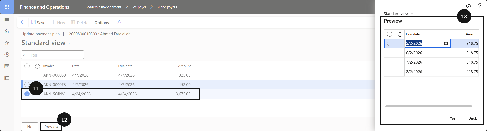
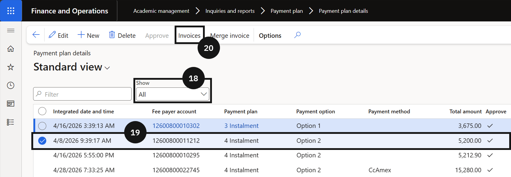
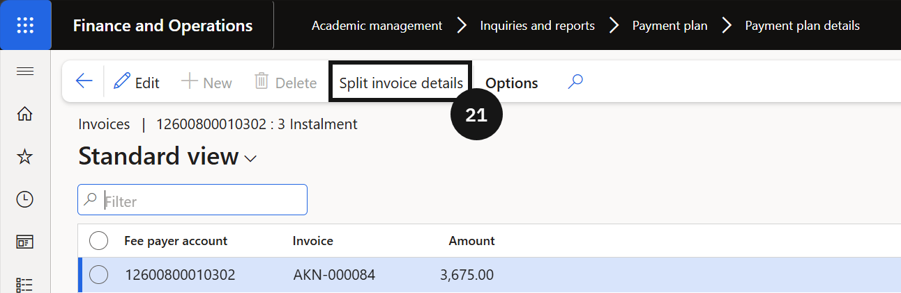
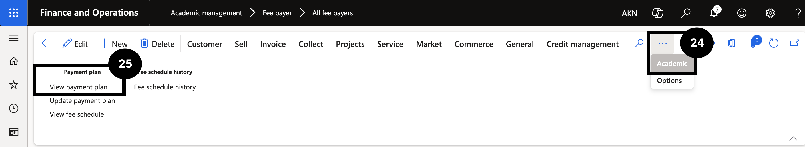

# Apply Payment Plan to Fee Payer

With payment schedules configured and the payment plan template in place, apply the plan to an individual fee payer's account to split their outstanding invoices into instalments.

1. Set the payment plan on the fee payer

   From the **FNO dashboard**, open **Modules ▸ Academic management**, expand **Fee payer**, and click **All fee payers**. Select and open the fee payer account (③). Expand the **Payment defaults** section and click **Edit** in the Action Pane. Select a **Method of payment** (⑥) and choose the **Payment plan** to apply (⑦). Click **Save**.

   

   

2. Apply the plan to invoices

   Click the **Academic** tab (⑨) and click **Update payment plan** (⑩). Tick the **Mark** checkbox to select one or more invoices (⑪). Click **Preview** in the bottom left to review the split invoices (⑫). Review the details, then click **Yes** in the bottom-left corner to proceed, or **Back** to cancel (⑬). Click **Save**.

   

3. Verify the payment plan

   To view all fee payers on a payment plan, open **Modules ▸ Academic management ▸ Inquiries and reports**, expand **Payment Plan**, and click **Payment plan details**. Change the filter to **Show All** (⑱). Select the invoice (⑲), click **Invoices** in the toolbar (⑳), then click **Split invoice details** (㉑) to verify the invoices were split correctly.

   To view the plan directly from the customer, navigate to the fee payer record, click **Academic** on the Action Pane (㉔), and under **Payment plan** select **View payment plan** (㉕).

   

   

   
