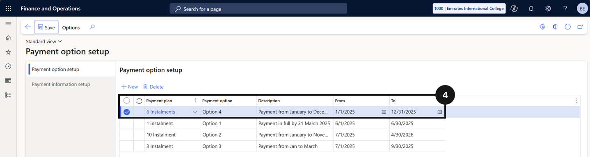

# Apply the Payment Schedule to Payment Plans

This process defines the payment options available to parents and controls which valid plans are displayed on PXP and published on the customer statement.

1. Open Payment option setup and create a new entry

   From the **FNO dashboard**, open **Modules ▸ Academic Management**, expand **Setup**, and click **Payment option setup**. Click **New** and complete the following (④):

   - **Payment plan** — select the required payment plan.
   - **Payment option** — enter a name.
   - **Description** — enter a description.
   - Start date and End date — set the dates for when this payment option is available.

   

2. Save

   Click **Save**.
