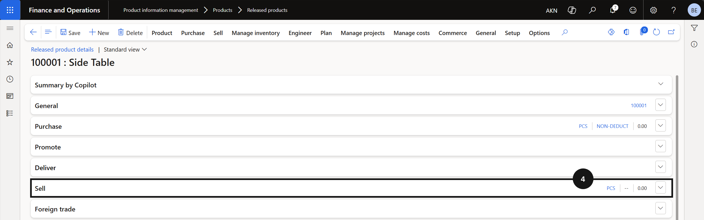
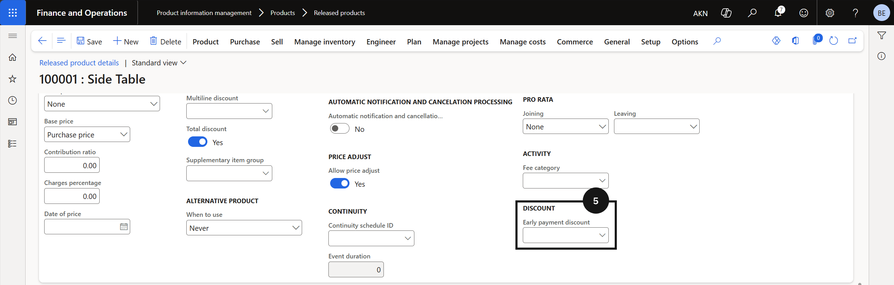

# Assign Early Payment Discounts to Products/Fees

This process is used for the Advance Discount Payment — Date-Based setup.

1. Open the fee item and assign the discount

   From the **FNO dashboard**, open **Modules ▸ Product information management**, expand **Products**, and click **Released products**. Select a relevant fee item (e.g., tuition, music lesson, sport class) (③). Expand the **Sell** section (④) and assign the relevant discount code using the **Early payment discount** dropdown (⑤).

   

   

   

2. Save

   Click **Save**.
