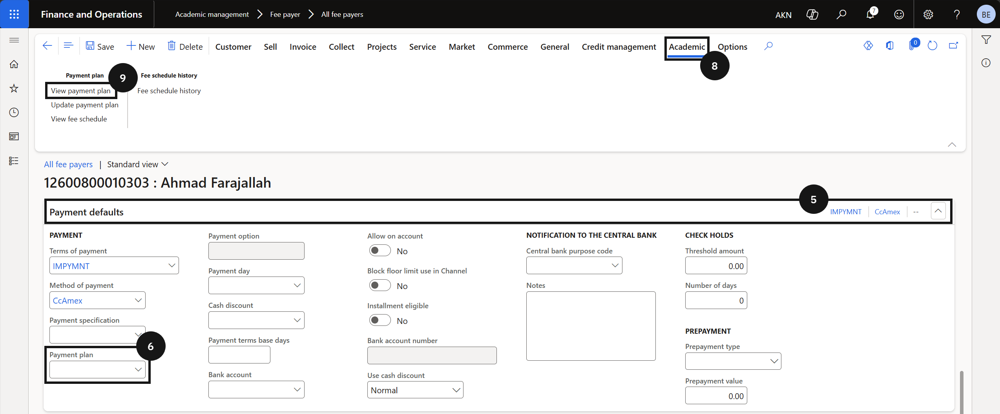

# Cancel or Amend a Payment Plan

If a fee payer's payment plan needs to be removed, clear the plan from their payment defaults and merge the split invoices back into a single invoice to restore the original invoice structure.

1. Remove the payment plan

   From the **FNO dashboard**, open **Modules ▸ Academic management**, expand **Fee payer**, and click **All fee payers**. Select and open the customer account. Click **Edit** in the toolbar. Expand **Payment defaults** and clear the **Payment plan** field. Click **Save**.

2. Merge split invoices

   Click the **Academic** tab and click **View payment plan**. Tick the **Mark** checkbox to select one or more invoices. Click **Merge invoice** in the toolbar to consolidate the split invoices back into a single invoice. Merge invoice is only available when split invoices already exist. Click **Yes** to confirm, then click **Save**.

