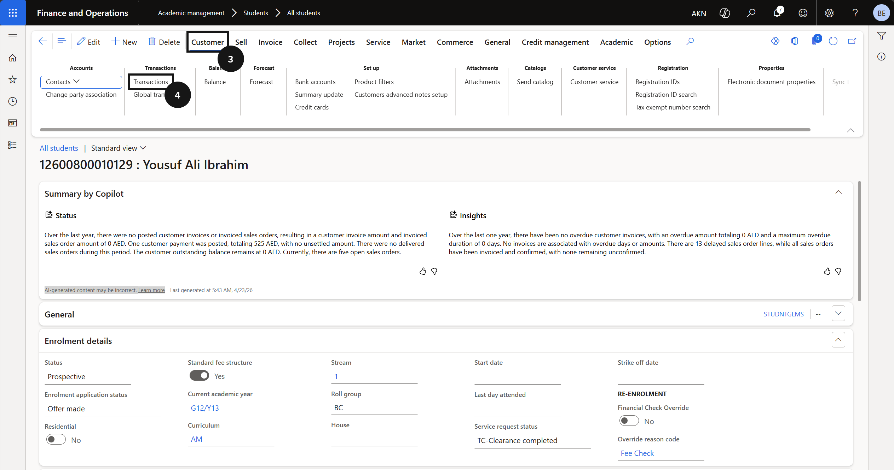
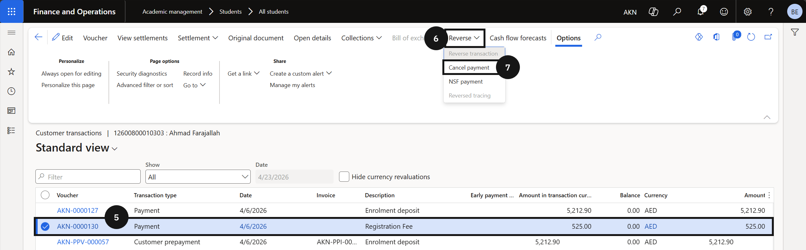
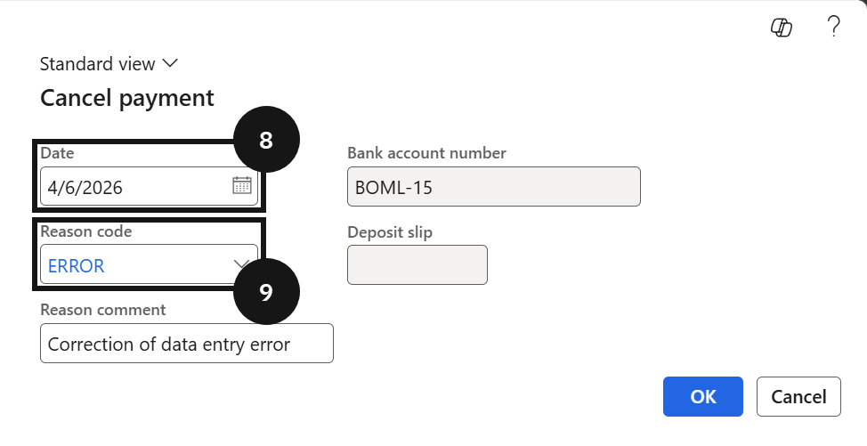

# Cancel a Receipt

Used when a posted customer payment needs to be reversed. The reversal date cannot be set prior to the original posting date.

1. Locate the transaction

   From the **FNO dashboard**, navigate to **Modules ▸ Academic Management ▸ Students ▸ All students**. Filter the list to locate the required student. Click **Customer** on the Action Pane, then click **Transactions**. Select the transaction to reverse.

2. Reverse and set the date

   Click **Reverse**, then click **Cancel payment**. Select the **reversal date** from the date picker. Select a value from the **Reason code** dropdown. Click **OK**.

