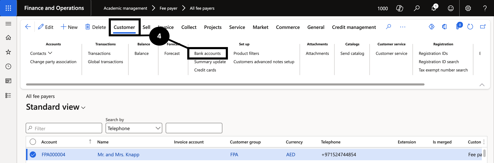

# Confirm Bank Account Details

Confirm a fee payer's bank details before paying any refund via bank file.

1. Open the bank accounts and verify

   Navigate to **Modules ▸ Academic management ▸ Students ▸ All students** (or **Fee payer** if using fee payer as the customer). Select the relevant record. On the Action Pane, click **Customer**, then under **Setup** find **Bank accounts**.

   Confirm that an active bank account exists and is marked for refunds or payment processing.

   If no bank account is listed, click **New**, enter the bank details (bank name, IBAN, SWIFT, currency), then click **Save**. If necessary, update an existing bank account and click **Save**.

