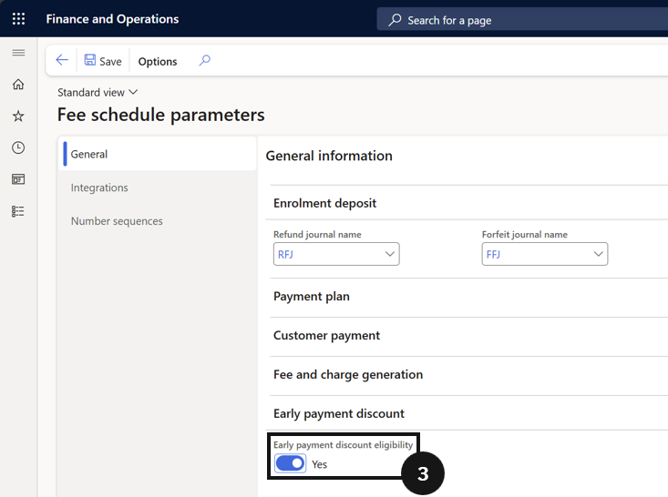

# Control Discount Eligibility Based on Payment

This setting controls whether the early payment discount applies when any invoice is paid before the early payment date, or only when **all** outstanding invoices are paid together by that date.

1. Open Fee schedule parameters and set eligibility

   From the **FNO dashboard**, open **Modules ▸ Academic Management**, expand **Setup**, and click **Fee schedule parameters**. Choose whether to enable or disable **Early payment discount eligibility** (③):

   - **Unchecked** — the discount applies even if only one invoice is paid.
   - **Checked** — the discount applies only if all due invoices are paid together.

   

2. Save

   Click **Save**.
