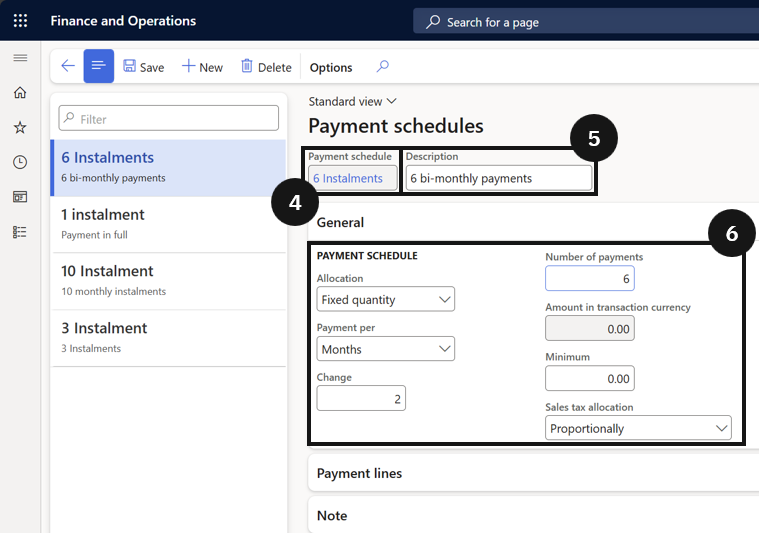

# Create a New Payment Plan

Payment schedules allow the school to offer fee payers the option to pay invoices in instalments rather than a single lump sum. The payment plan setup defines how offered plans display on the customer statement.

1. Open Payment schedules and create a new entry

   From the **FNO dashboard**, open **Modules ▸ Accounts receivable**, expand **Payments setup**, and click **Payment schedules**. Click **New** and complete the following:

   - **Code** — enter a unique code.
   - **Description** — enter a description for the payment schedule.
   - **Allocation** — select the payment allocation method.
   - **Payments per** — assign the timeline.
   - **Change** — enter the frequency.
   - **Number of payments** — enter the number of instalments.

2. Save

   Click **Save**.

