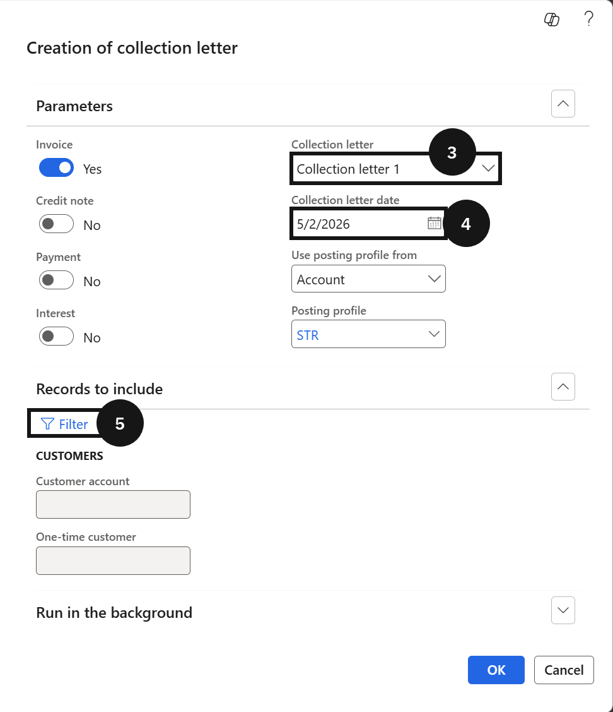
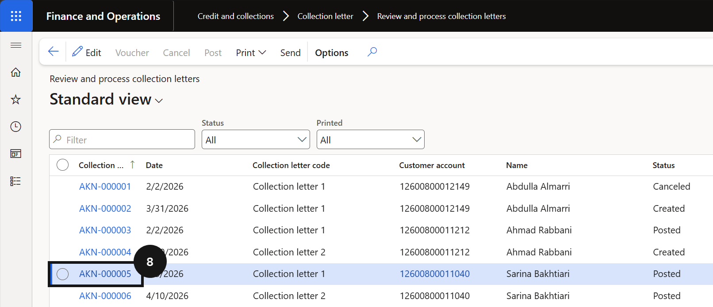
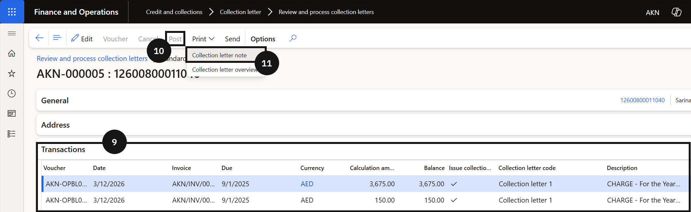
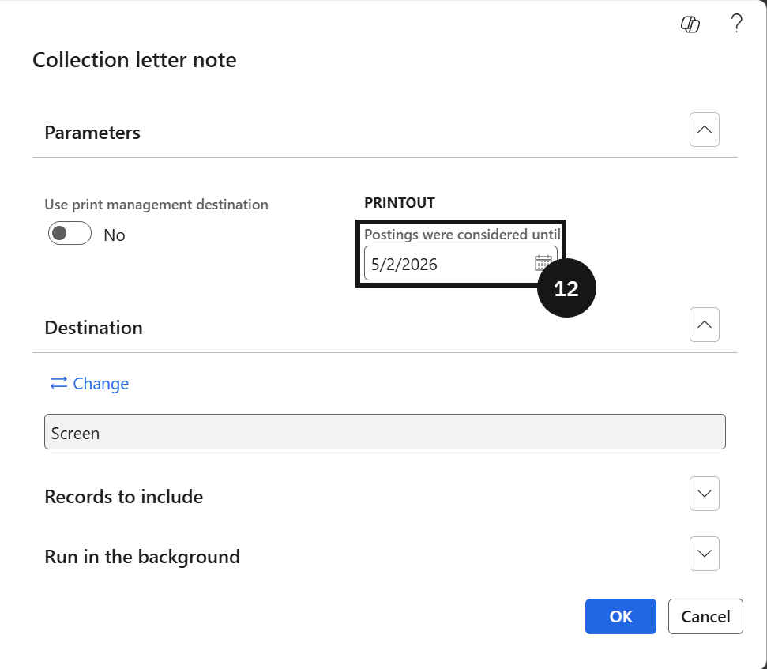

# Generate Collection Letters and Suspension Notices

Once the collection letter sequence is configured, run this process to generate reminders for fee payers with overdue balances. Repeat for each stage in the escalation sequence using the next collection letter code.

1. Create the collection letter

   From the **FNO dashboard**, open **Modules ▸ Credit and Collections**, expand **Collection letter**, and click **Create collection letters**. In **Parameters**, select the **Collection letter** code from the dropdown (③) and enter the **Collection letter date** (④). In **Records to include**, enter the **Customer account** to generate for one account only, or leave blank to generate for all eligible accounts (⑤). Click **OK**.

   

2. Review, post, and print

   Navigate to **Modules ▸ Credit and collections ▸ Collection letter ▸ Review and process collection letters**. Open the newly created letter (⑧), review the details including overdue amounts and related transactions, then click **Post** (⑩). Click **Print**, select **Collection letter note** (⑪), enter the required date in **Postings were considered until** (⑫), and click **OK**. Review the printed letter for accuracy.

   

   

   

3. Repeat for each stage

   Repeat all steps for the next letter in the sequence, using the next collection letter code and the correct date according to the escalation schedule.
