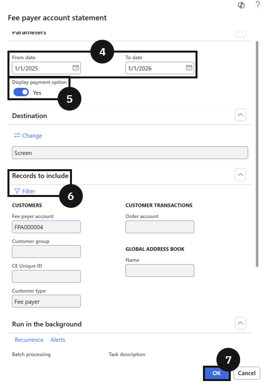

# Generate Fee Statements in Bulk

Fee payer account statements provide a consolidated view of outstanding invoices, credits, and payment history over a defined period. Typically distributed ahead of payment deadlines to give families a clear picture of what is owed.

1. Open Fee payer account statement and set parameters

   From the **FNO dashboard**, open **Modules ▸ Academic Management**, expand **Inquiries and reports**, then expand **Fee payer statement report**, and click **Fee payer account statement**. Complete the following:

   - **Start date** and **End date** — enter the date range for the statement period.
   - **Payment options** — select whether to show payment options on the statement.

   In **Records to include**, click **Filter** to choose a specific account. Leave blank to generate for all eligible accounts.

2. Generate and distribute

   Click **OK** to generate the statement. Review the completed statement and distribute it to the fee payer as required.

