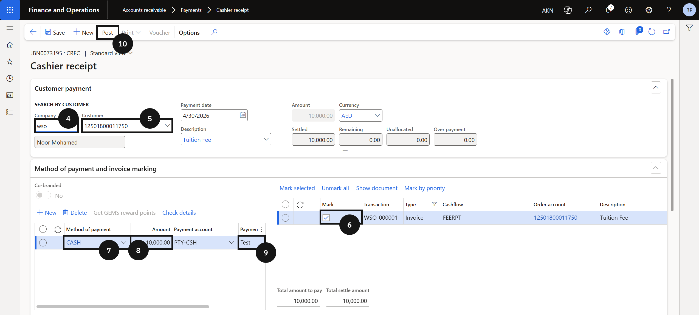
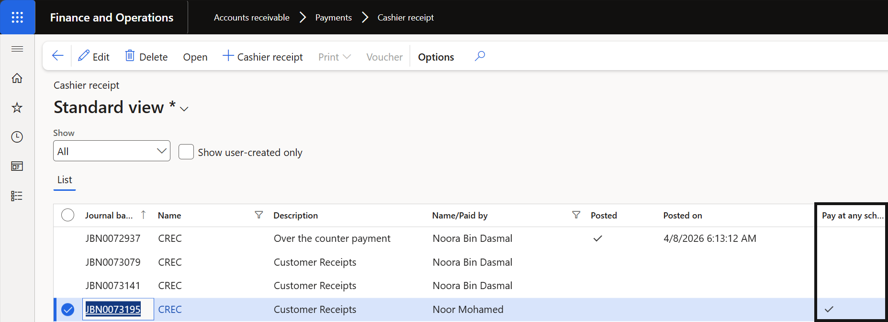

# Pay at Any School

The pay at any school process allows staff to receive and record fee payments on behalf of any school within the group, regardless of which school the student is enrolled at.

1. Create the cashier receipt

   From the **FNO dashboard**, open **Modules ▸ Accounts receivable**, expand **Payments**, and click **Cashier receipt report**. Click **+ Cashier receipt** and complete the following:

   - **Company** — select the school receiving the payment.
   - **Customer** — select the student the payment is being received for.
   - Mark the **invoice** to be paid.
   - **Method of payment** — select from the dropdown.
   - **Amount** — enter the payment amount. The **Payment account** autofills based on the method selected.
   - **Payment reference** — enter a reference.

2. Post and deliver the receipt

   Click **Post** on the Action Pane. Enable the **Print receipt** toggle if a receipt is required. Click **OK** to post the transaction.

   Once posted, the **Pay at Any School** column on the header is ticked, identifying the record as a Pay at Any School transaction.

