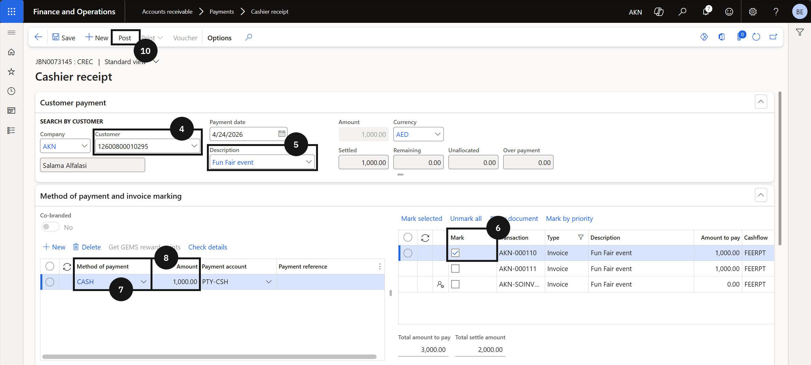

# Process an Activity Invoice Payment

Use this process to receipt a payment against an activity or sessional class invoice at the cashier counter.

1. Create the cashier receipt

   From the **FNO dashboard**, open **Modules ▸ Accounts Receivable**, expand **Payments**, and click **Cashier receipt**. Click **+ Cashier receipt** and complete the following:

   - **Customer** — select the student account.
   - **Description** — enter a description.
   - Tick the **Mark** checkbox for the activity fee invoice in the invoices panel on the right.
   - **Method of payment** — select the payment method.
   - **Amount** — enter the activity fee amount.
   - **Payment reference** — enter a reference if required.

2. Post and deliver the receipt

   Click **Post** in the Action Pane. Enable the **Print receipt** toggle and click **OK** to post the journal.

