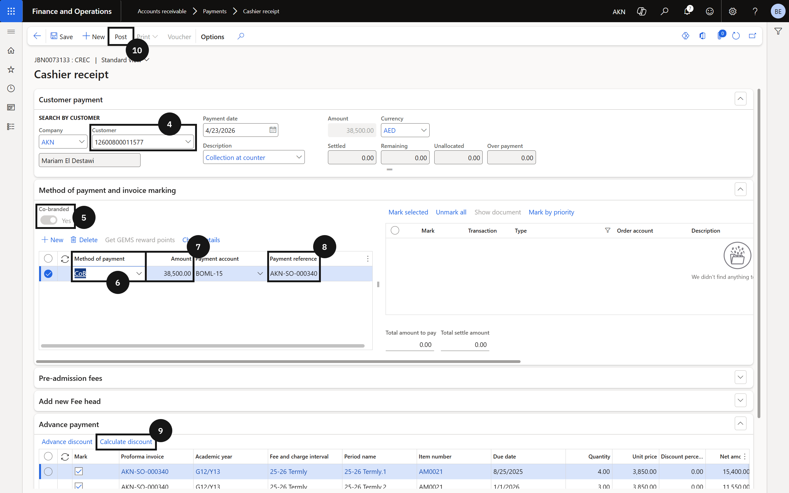
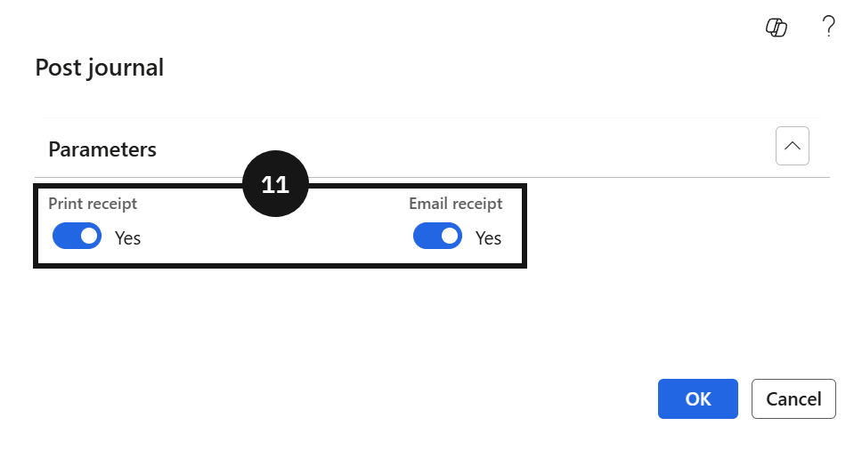

# Process an Advance Payment

Before processing, confirm that the Advanced Discount Policy is configured for the relevant fee and charge interval and that a proforma invoice has already been generated for the student.

1. Create the cashier receipt and apply the co-branded method

   From the **FNO dashboard**, open **Modules ▸ Accounts Receivable**, expand **Payments**, and click **Cashier Receipt**. Click **+ Cashier receipt** and complete the following:

   - **Customer** — enter the student account.
   - **Co-branded** — enable this option under Method of Payment. Enabling Co-branded activates the **Calculate Discount** button.
   - **Method of payment** — select the co-branded method from the dropdown.
   - **Amount** — enter the total amount to be paid. To pay 3 terms enter the combined total of all 3 term invoice amounts; to pay 2 terms enter the 2-term combined total. The discount rate applied depends on the number of terms the entered amount covers.
   - **Payment Reference** — enter the sales order number.

2. Calculate discount and post

   Click **Calculate Discount**. The system automatically populates the discount rate and discount amount based on the Advanced Discount Policy configuration. Click **Post**, select your receipt options, and click **OK**.

   The system generates one prepayment invoice per term covered. Posted transactions include one receipt/payment transaction and one prepayment invoice per term paid.

