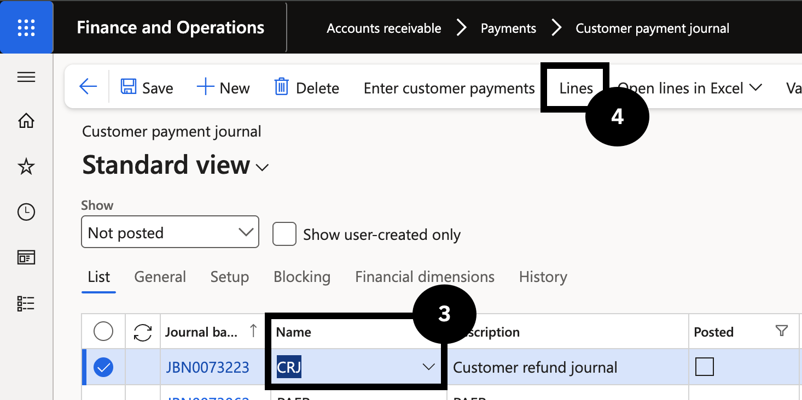
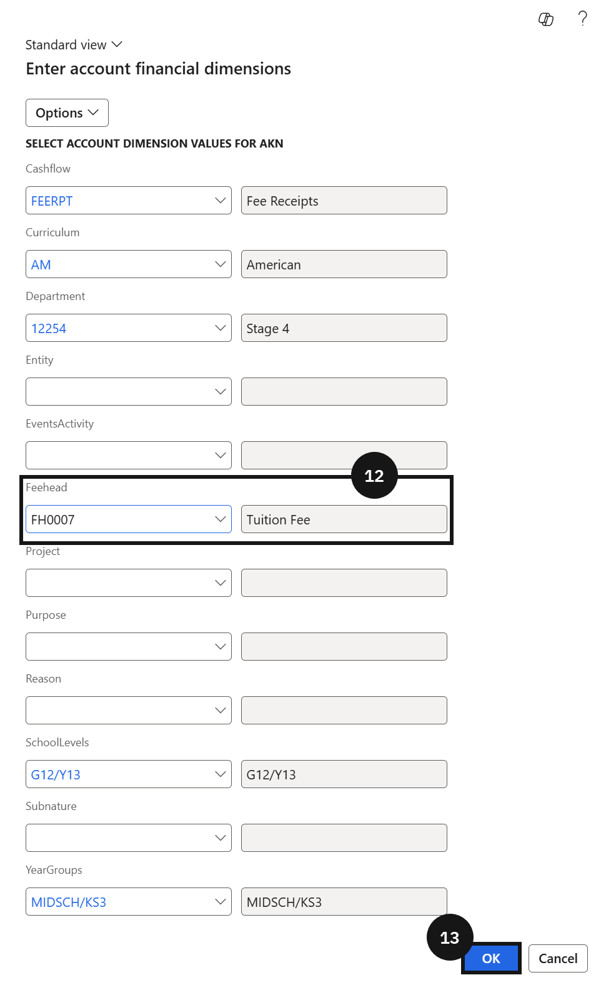
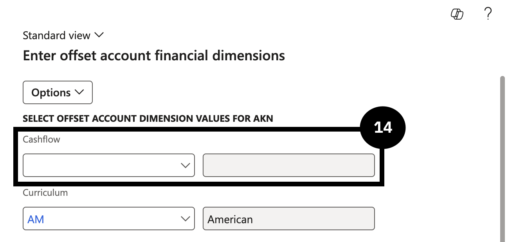

# Process a Fee Refund of Credit Balance

> **Note:** If a workflow is active, submit the journal for approval and follow the workflow process until the journal is approved before posting.

Proceed with the refund only after confirming the bank details. See [Confirm Bank Account Details](./confirm-bank-account-details.md).

1. Create the refund journal

   From the **FNO dashboard**, navigate to **Modules ▸ Accounts receivable ▸ Payments ▸ Customer payment journal**. Click **New** and in the **Name** field select **Customer refund journal** (③). Click **Lines** (④).

   

2. Select the student and settle the credit invoice

   Mark the selected row in the list. In the **Account** field (⑤), select the **Student account**. Enter a value in the **Description** field (⑥). In the **Method of payment** field (on the far right) (⑦), select the refund method.

   Click **Settle transactions** (⑧) to find and select the credit invoice. Select the **Mark** checkbox (⑨) for the desired invoice, then click **OK** (⑩).

   

   

4. Set financial dimensions and post

   Click **Financial dimensions** and select **Account** (⑪). In the **Feehead value** field (⑫), select a value and click **OK** (⑬). Click **Financial dimensions** again, click on the **Offset account** field, and in the **Cashflow** field select **Refund** (⑭). Click **OK**.

   Click **Post** (⑯).

   

   

   
