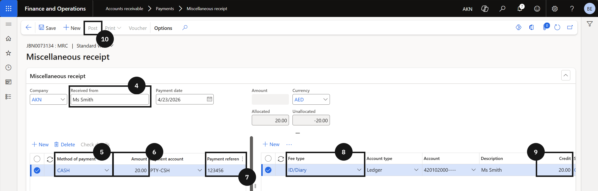

# Process a Miscellaneous Receipt

Used to record incoming payments not linked to a specific student invoice or customer account — such as event fees, lost property charges, or sundry income.

1. Create the miscellaneous receipt

   From the **FNO dashboard**, open **Modules ▸ Accounts Receivable**, expand **Payments**, and click **Miscellaneous receipt**. Click **+ Miscellaneous receipt** (③) and complete the following:

   - **Received From** (④) — enter the cashier or payer name.
   - **Method of payment** (⑤) — select the method. The **Payment account** populates automatically.
   - **Amount** (⑥) — enter the amount.
   - **Payment reference** (⑦) — enter a reference.
   - **Fee type** (⑧) — select from the dropdown. The **Account**, **Description**, and **Sales tax group** fields populate automatically.
   - **Credit** (⑨) — enter the amount in the Credit field.

   

   

2. Post and deliver the receipt

   Click **Post** (⑩). Enable the **Print receipt** toggle if a printed receipt is required. Click **OK** to complete the transaction.
