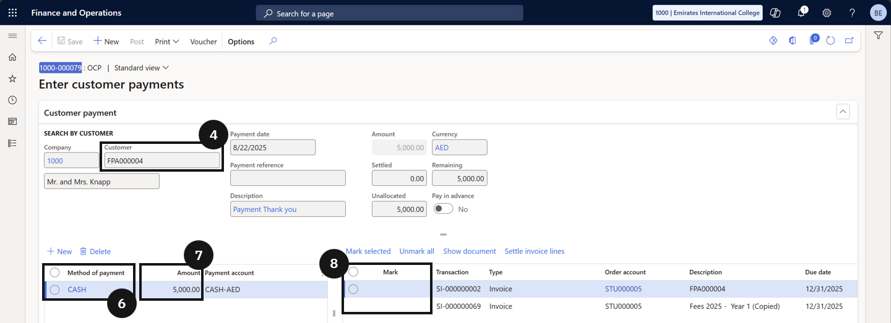

# Process an Over-the-Counter Payment

Over-the-counter payment processing is used when a fee payer makes a payment directly at the school.

1. Create the payment

   From the **FNO dashboard**, open **Modules ▸ Accounts receivable**, expand **Payments**, and click **Over the counter payment**. Click **+ Create Customer Payment** in the Action Pane. Choose the **fee payer** from the list. Select the **payment method** (e.g., credit card or cash) from the **Method of payment** column. Enter the **amount being paid** and select the **payment account** where the funds will be deposited. Mark the invoices the payment should be applied to.

   If the payment exceeds the invoice total, the system automatically checks the **Pay in Advance** box and records the extra amount as an advance.

2. Post and deliver the receipt

   Click **Post** to finalise the entry. In the dialog, select your print and/or email receipt options and click **OK**.

