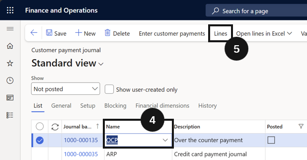
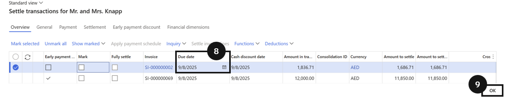
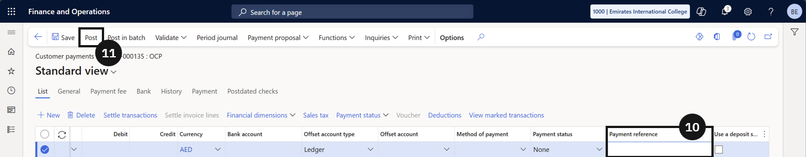

# Process a Payment with an Early Payment Discount

The system automatically applies the discount when the payment date is before the discount due date.

1. Create the payment journal

   From the **FNO dashboard**, open **Modules ▸ Accounts receivable**, expand **Payments**, and click **Customer payment journal**. Click **New**, select the **Name**, then click **Lines** in the toolbar.

2. Settle the invoice with the discount

   Select the **fee payer** and click **Settle transactions**. Set the **payment date** to a date before the discount due date. Settle the invoice(s) by clicking **OK** — the system automatically applies the discount, reducing the payable amount. Enter the **Payment reference**, then click **Post**.

3. Verify the discount

   Check the voucher to confirm the discount was posted. Click the three dots in the toolbar and choose **All related vouchers** to see the discount amount.

