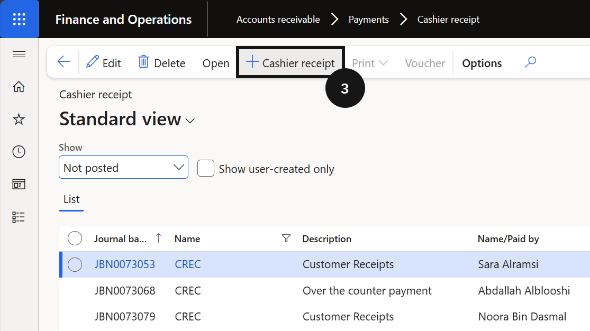
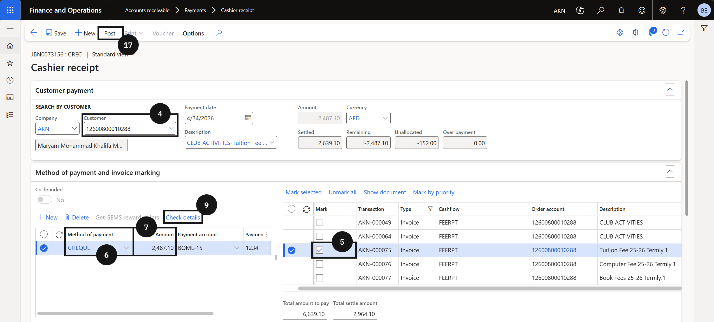
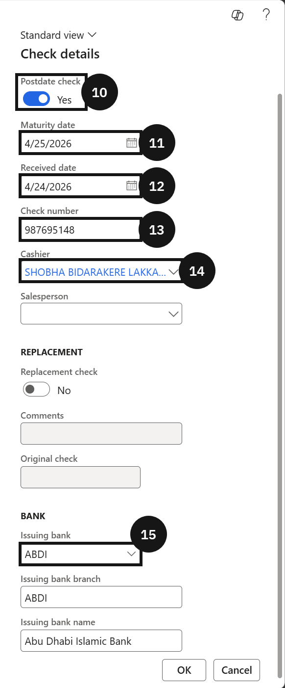

# Process a Post-Dated Cheque

When a fee payer provides a cheque dated for future settlement, record it as a post-dated cheque so the maturity date and bank details are captured with the receipt.

1. Create the cashier receipt

   From the **FNO dashboard**, open **Modules ▸ Accounts receivable**, expand **Payments**, and click **Cashier receipt**. Click **+ Cashier receipt** (③) and complete the following:

   - **Customer** (④) — select the student account.
   - **Mark** the payment (⑤) to be applied on the right-hand side.
   - **Method of payment** (⑥) — select *Cheque*.
   - **Amount** (⑦) — enter the amount.
   - **Payment reference** — enter a reference if required.

   

   

2. Enter cheque details

   Click **Check details** (⑨)(this button only becomes active when the Method of payment is set to Cheque). Enable the **Postdate check** toggle (⑩) and complete the following:

   - **Maturity date** (⑪) — enter the cheque maturity date.
   - **Received date** (⑫) — enter the date the cheque was received.
   - **Check number** (⑬) — enter the cheque number.
   - **Cashier** (⑭) — enter the name of the cashier who collected the cheque.
   - **Issuing bank** (⑮) — select the customer's bank.

   Click **OK**.

   

3. Post and deliver the receipt

   Click **Post** on the Action Pane (⑯). Enable the **Print receipt** toggle and click **OK** to post the journal.
