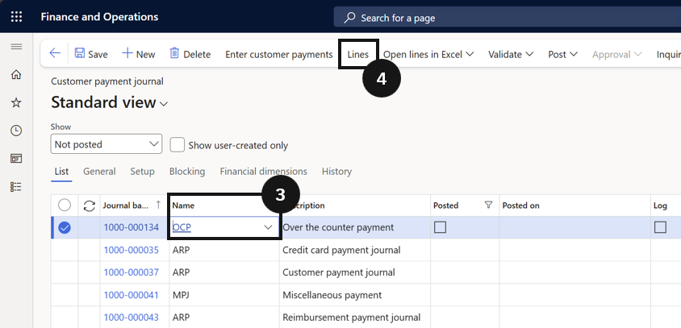
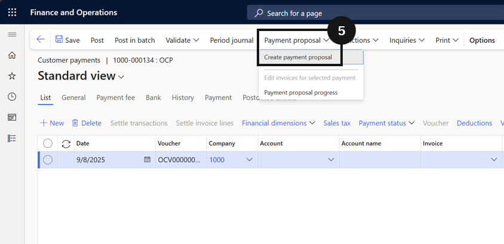

# Schedule Credit Card Payments

Scheduled credit card processing handles bulk fee payments via credit card for a defined period.

1. Create the journal and generate a payment proposal

   From the **FNO dashboard**, open **Modules ▸ Accounts receivable**, expand **Payments**, and click **Customer payment journal**. Click **New**, select the appropriate journal (③), then click **Lines** in the Action Pane (④).

   Click **Payment Proposal** and select **Create Payment Proposal** (⑤). In the dialog, set the **date range** for due invoices (⑥) (e.g., January 1 to January 31), set the **Method of payment** to the credit card (CC) method (⑦), set the **Summarised payment date** (⑧), then click **OK** (⑨). The system lists all invoices due within the selected period.

   

   

   

2. Select invoices and create payments

   Select the invoices to be paid, or leave all unmarked to select all (⑩). Click **Create Payments** to transfer selected invoices to the payment journal. Delete any lines with zero or debit amounts before proceeding. Enter the **Payment reference** as required (⑪).

   
   
3. Authorise and post

   Click **Functions** in the Action Pane, then select **Generate Credit Card Payments** (⑬). The system requests authorisation from the service provider. If successful, the status changes to Approved. If authorisation fails, a failure message appears, unauthorised lines are deleted, and those transactions must be manually retried or reviewed.

   Once authorisation is received, click **Post**.

   
