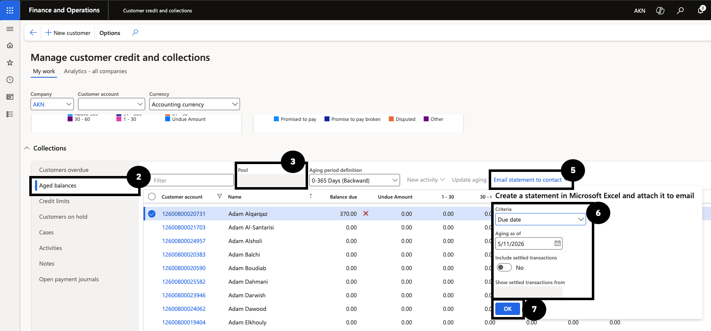
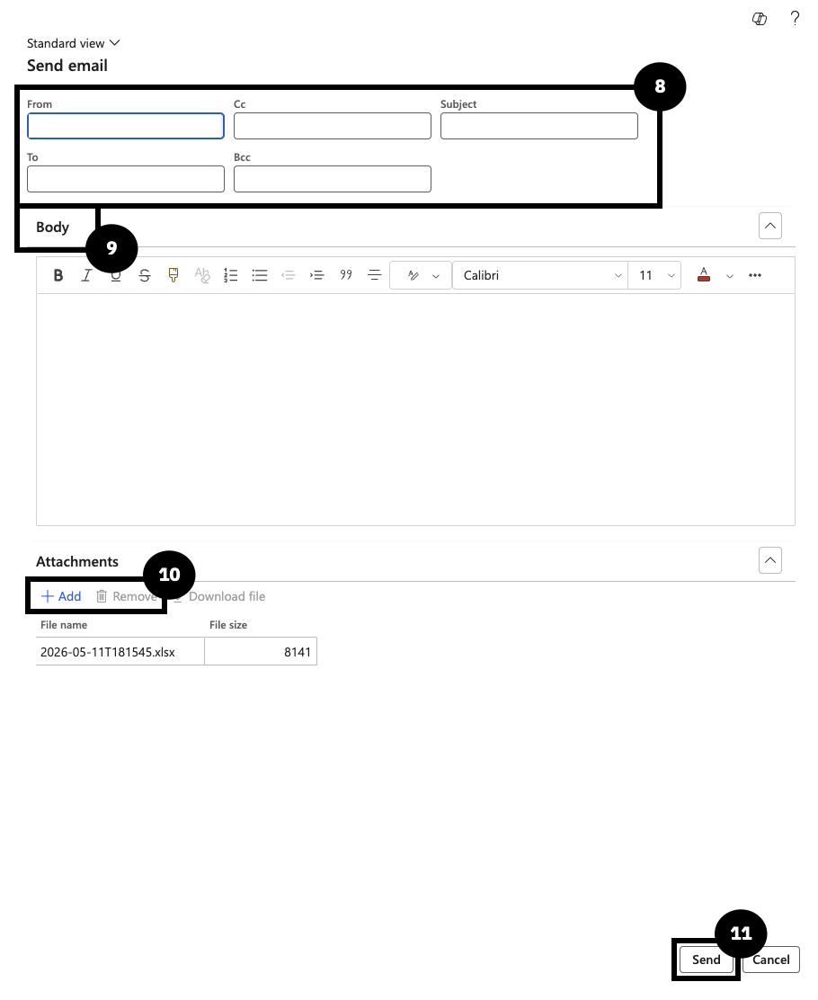

# Send a Customer Statement Email

Use this process to send balance or transaction details to customers or fee payers who are not part of the automated collection letter workflow.

1. Find the customer in Aged balances

   From the **FNO dashboard**, open **Workspaces ▸ Customer credit and collections**. In **Collections**, click **Aged balances** to view the customer list and balances. Filter the list by **Pool** to find the customer and select them.

2. Configure and send the statement email

   Click **Email statement to contact**. In the **Create a statement in Microsoft Excel and attach it to email** dialog, set the following:

   - **Criteria** — select *Due Date* to attach transactions as of the selected date.
   - **Include settled transactions** — select *Yes* if required.
   - **Show settled transactions from** — set to the required date (typically the aging date).

   Click **OK**. In the **Send email** form, verify the **From** address, confirm the **To** recipient, enter the **Subject**, and enter the email **Body**. Use **+ Add** to include additional attachments or **Remove** to delete one. Click **Send**.

