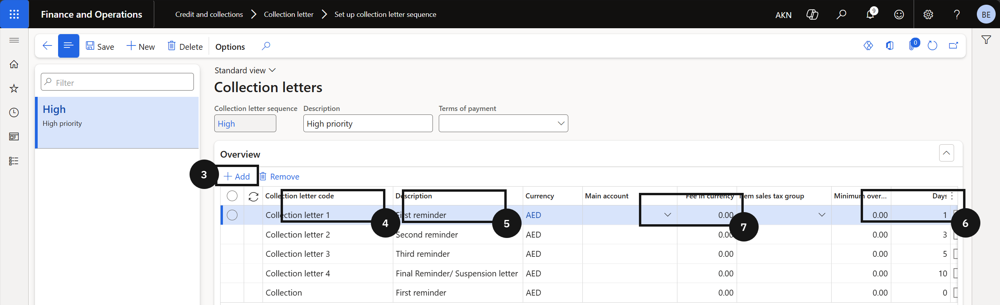
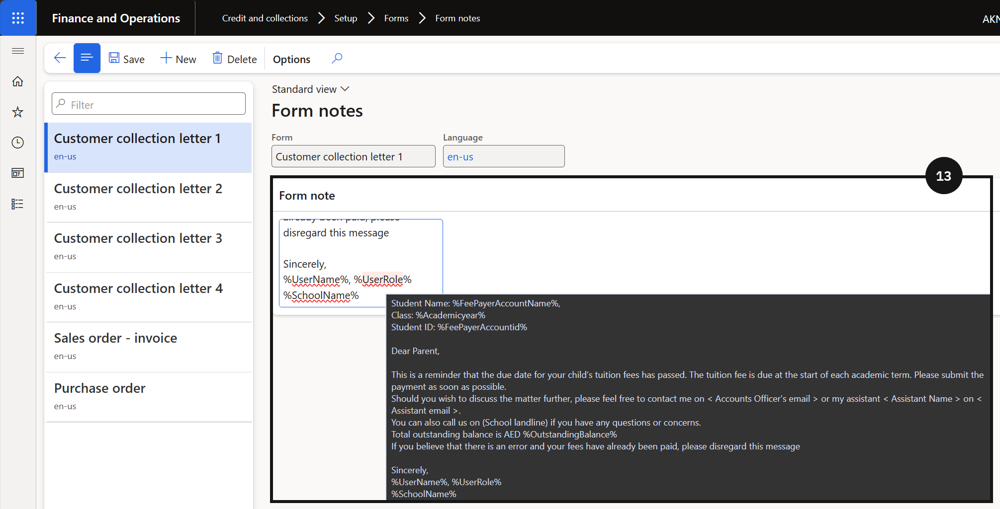

# Set Up Collection Letters

Before collection letters can be generated, a sequence of reminder stages must be configured — typically a first reminder, a second reminder, and a suspension letter. Each stage is defined by a number of days after the due date.

1. Configure the collection letter sequence

   From the **FNO dashboard**, open **Modules ▸ Credit and Collections**, expand **Collection letter**, and click **Set up collection letter sequence**. Click **+ Add** (③) and complete the following for each stage:

   - **Collection letter code** (④) — select from the dropdown (e.g., *First Reminder*).
   - **Description** (⑤) — enter a description.
   - **Days** (⑥) — enter the number of days after the invoice due date when the letter should be sent.
   - Fee in currency (⑦) — enter if applicable; leave blank if none apply.

   Repeat to add each additional stage (e.g., *Second Reminder*, *Suspension Letter*). Click **Save**.

   

2. Configure the note text

   Navigate to **Modules ▸ Credit and Collections**, expand **Setup ▸ Forms**, and click **Form notes**. Enter the note text to print on each collection letter. Include student account, student ID, and outstanding amount if needed (⑬). Adjust the tone based on the reminder stage. Click **Save**.

   
