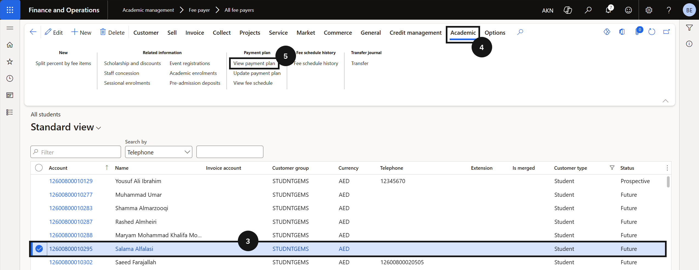
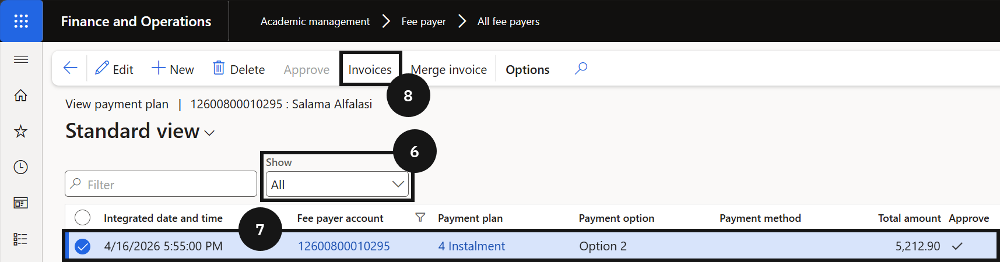
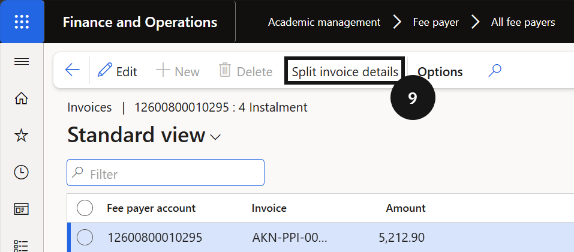

# View Payment Plan Details

Use the student's payment plan view to check how their invoices have been split and confirm the instalment schedule.

1. Open the student's payment plan

   From the **FNO dashboard**, open **Modules ▸ Academic management**, expand **Students**, and click **All Students**. Select the student record (③). Click the **Academic** tab (④) and click **View payment plan** (⑤). Change the filter to **All** to review all payment plans (⑥).

   

2. Review the instalment breakdown

   Select a payment plan record (⑦) and click **Invoices** (⑧) to view all invoices linked to it. Click **Split invoice detail** (⑨) to view the instalment breakdown for each invoice.

   

   
