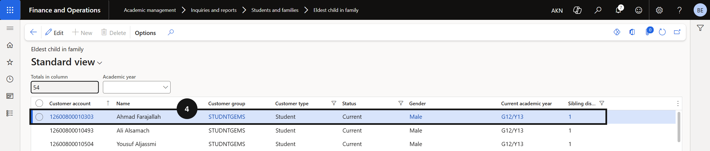
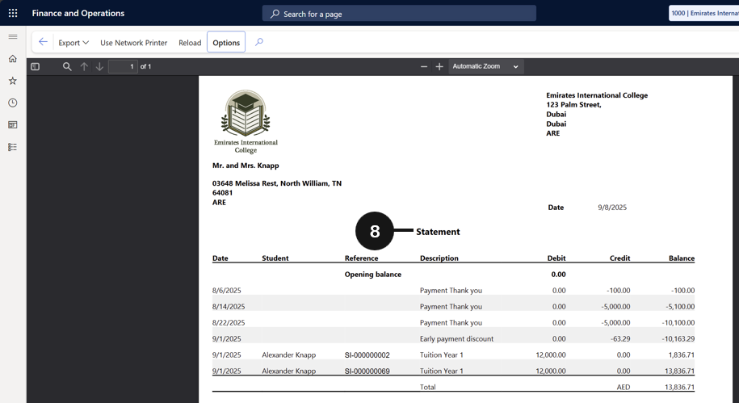

# Inquiry & Reports

Inquiries and Reports gives finance and administration staff direct access to key student and family financial data within Academic Management. It includes reports for identifying the eldest child in a family, calculating the number of siblings per family, and viewing other student and family-level financial information used to support sibling discount processing and fee payer management.

---

## Eldest Child in Family 

1. From the **FNO dashboard**, open **Modules ▸ Academic Management**. 
2. Expand **Inquiries and reports**, then select **Students and families**. 
3. Select **Eldest child in family**. 
4. View the information related to the **Eldest Child in family**. 

---

## Number of Siblings by Family Report 

1. From the **FNO dashboard**, open **Modules ▸ Academic Management**. 
2. Expand **Inquiries and reports**, then expand **Students and families**. 
3. Click **Number of siblings by family details**. 
4. Define the duration in the **As on** field. 
5. Click **Show data**. 
6. Review the data. 

---

## Generate Fee Statements

1. From the **FNO dashboard**, open **Modules** ▸ **Academic Management**.
2. Expand **Inquiries and reports**, then expand **Fee payer statement report**.
3. Click **Fee payer account statement**.
4. Enter the **start and end dates** for the statement period you want to generate.
5. Decide whether to show **payment options** on the statement by selecting the appropriate option.
6. Open the **Records to include** section and click **Filter** to choose the specific account for which you want to generate the statement.
7. Click **OK** to generate the statement for the selected account.
8. Review the completed statement and distribute it to the fee payer as required.

---
