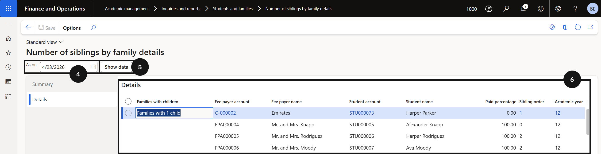

# Number of Siblings by Family Report

The Number of Siblings by Family report shows how many siblings are enrolled per family as of a selected date. Use this to support sibling discount processing and fee payer management.

1. Open the report

   From the **FNO dashboard**, open **Modules ▸ Academic Management**, expand **Inquiries and reports**, expand **Students and families**, and click **Number of siblings by family details**.

2. Filter and review

   Enter the relevant date in the **As on** (④) field and click **Show data** (⑤) to load results. The report shows the sibling count per family as of that date (⑥).

   
