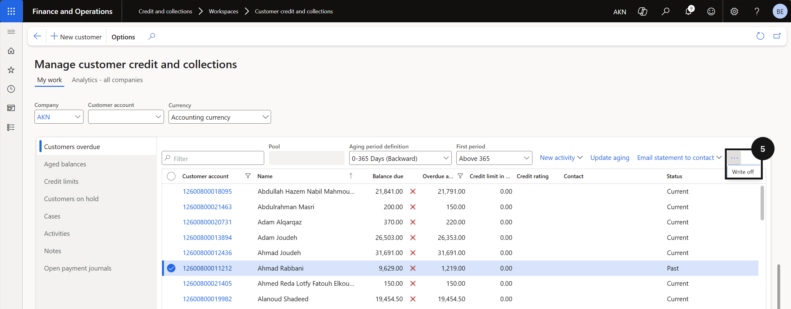
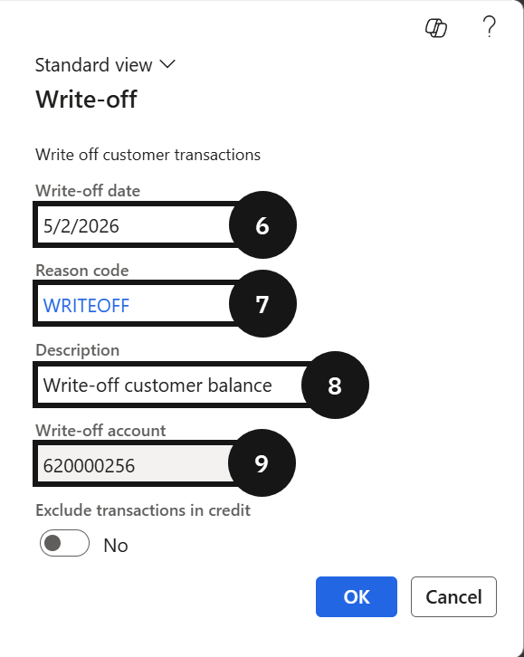
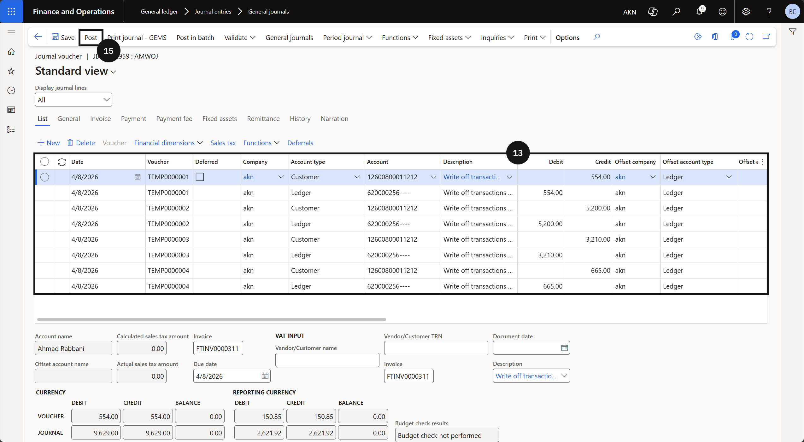
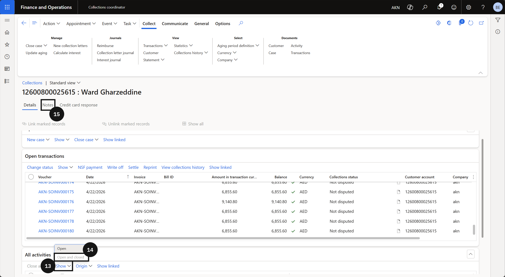

# Debt Follow-up

Debt Follow-Up supports the management and resolution of outstanding student balances. It covers processes for customer write-back, bulk write-off of unrecoverable debts, debt classification, and the use of Excel upload options to manage excluded students or update debt records in bulk. These tools allow finance teams to maintain accurate accounts receivable records and manage aged debt in a structured and auditable way.

---

## Customer Write-back

---

## Customer Bulk Write-off

> **Note**: Ageing definitions, reason codes, and posting accounts must already be configured.

1. From the FNO dashboard, open **Modules** ▸ **Credit and Collections**.
2. Expand **Setup** then click **Aging period definitions**.
3. Review the ageing criteria and identify the overdue customers or transactions.
4. Go back to **Credit and Collections**, expand **Workspaces**, then click **Customer credit and collections**. 
5. Click **Write Off**.
6. Enter the **Write Off Date**.
7. Select the **Reason Code**.
8. Enter a **Description**.
9. Confirm the **Posting account**.
10. Click **OK** to create the write-off journal.
11. Go to **Modules** ▸ **General Ledger** ▸ **Journal entries** ▸ **General journals**.
12. Locate and open the new journal.
13. Review the new journal.
14. Submit the journal for workflow approval, if required.
15. Click **Post** to finalise the write-off.

> **Note:**: If workflow is not enabled, post the journal directly.

---

## Debt Classification 

---

## Excel Upload Options

---

## Bad Debt Provision

---

## Record Debtor Notes

Debtor notes are used to record interactions with fee payers — such as phone calls or promises to pay — directly against the customer's account. Notes can be dated and filtered, and each entry can be reviewed in full detail at any time through the customer collections view.

1. From the **FNO dashboard**, open **Modules** ▸ **Workspaces** ▸ **Collections coordinator**.
2. Locate the relevant debtor account and click **View customer detail**.
3. Click the **New activity** dropdown.
4. Select the **Event category**.
5. Select the **Type**.
6. Enter the **Purpose** of the interaction.
7. Enter the details of the interaction in the **Notes** field.
8. Set the **Date and time** of the interaction. 

> **Note:** *The date and time field can be set to a future date to record a scheduled follow-up activity.*

9. Click **Create event**.
10. Review the created note in the events list on the customer detail screen.

> **Note:** *Hover over a note in the events list to preview the note content without opening the full record.*

11. To view the full note history for a customer, click **View customer**.
12. Open **Collect** and click **Collections**.
13. Click on **Show** in **All activities**.
14. Select **Open and closed** to display all notes, including resolved items.
15. Click the **Notes** tab to review.

---
