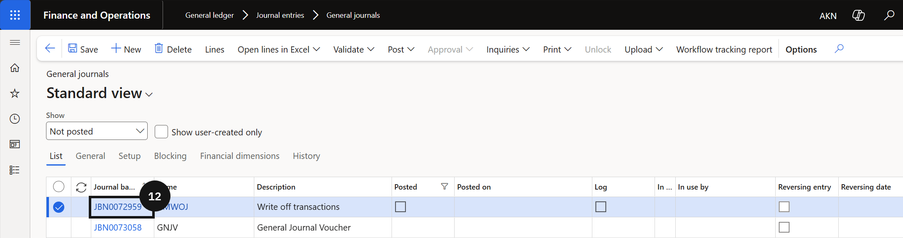

# Customer Bulk Write-Off

The bulk write-off process removes unrecoverable debt balances from accounts receivable by posting an offsetting journal entry to the configured bad debt account. Ageing definitions, reason codes, and the posting account must already be in place before running a write-off.

1. Review ageing and identify overdue accounts

   From the **FNO dashboard**, open **Modules ▸ Credit and Collections**, expand **Setup**, and click **Aging period definitions**. Review the ageing criteria and identify the overdue customers or transactions to write off.

2. Run the write-off

   Open **Modules ▸ Workspaces ▸ Customer credit and collections** and click **Write Off** (⑤). Complete the following:

   - **Write Off Date** (⑥) — enter the date for the write-off.
   - **Reason Code** (⑦) — select the applicable reason.
   - **Description** (⑧) — enter a description.
   - **Posting account** (⑨) — confirm the bad debt account is correct.

   Click **OK** to create the write-off journal.

   

   

3. Review and post the journal

   Go to **Modules ▸ General Ledger ▸ Journal entries ▸ General journals**, locate and open the new journal (⑫), and review the entries (⑬). If workflow is enabled, submit the journal for approval. Once approved (or if workflow is not enabled), click **Post** (⑮) to finalise the write-off.

   

   
