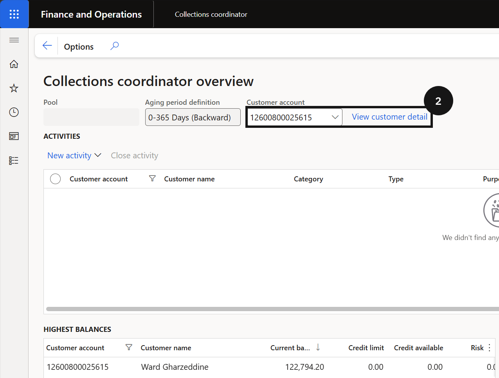
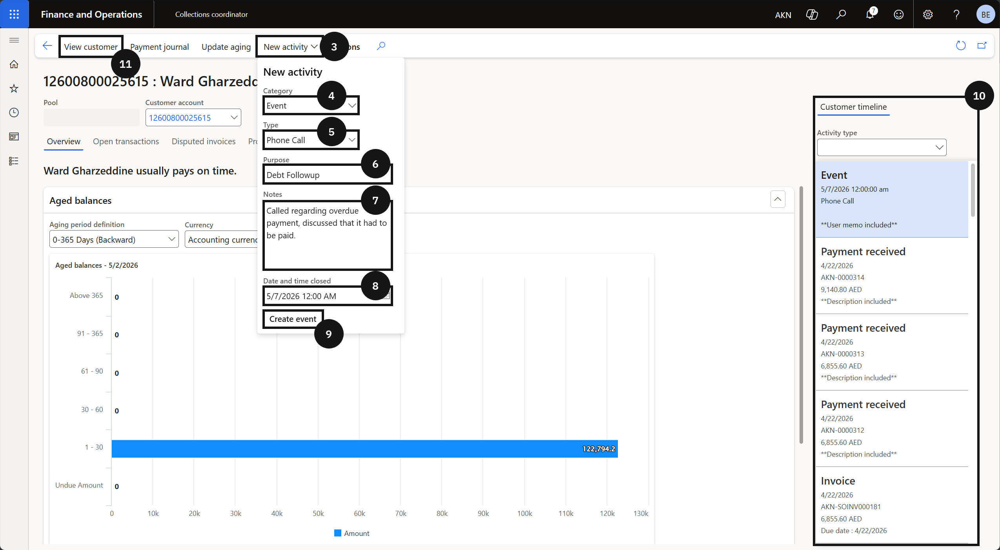
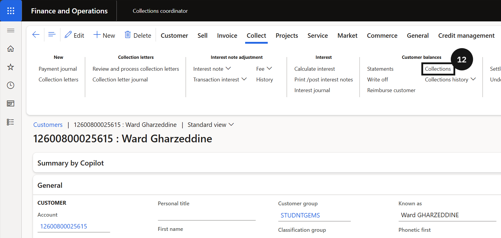

# Record Debtor Notes

Debtor notes record interactions with fee payers — such as phone calls or payment promises — directly against the customer's account. Each entry can be dated, and future dates can be set to schedule follow-up activities.

1. Open the customer detail

   From the **FNO dashboard**, open **Modules ▸ Credit and collections ▸ Workspaces ▸ Collections coordinator**. Locate the relevant debtor account and click **View customer detail** (②).

   

2. Create the note

   Click the **New activity** dropdown (③) and complete the following:

   - **Event category** (④) — select the category that matches the interaction type.
   - **Type** (⑤) — select the specific event type.
   - **Purpose** (⑥) — enter the purpose of the interaction.
   - **Notes** (⑦) — enter the details of the interaction.
   - **Date and time** (⑧) — set the date and time; use a future date to schedule a follow-up.

   Click **Create event** (this will change to match the category selected above) (⑨). The new note appears in the **Customer timeline** screen (⑩) — hover over a note to preview the content without opening the full record.

   

3. Review all notes

   Click **View customer** (⑪) to open the full note history. Open **Collect**, click **Collections** (⑫), then click **Show** (⑬) in **All activities**. Select **Open and closed** (⑭) to display all notes including resolved items, then click the **Notes** tab (⑮) to review.

   

   
