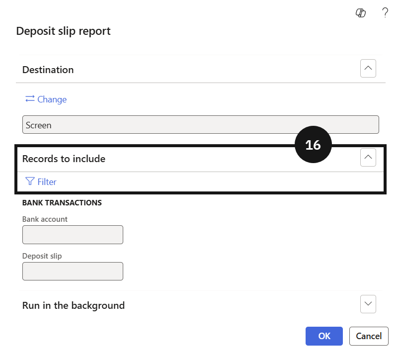
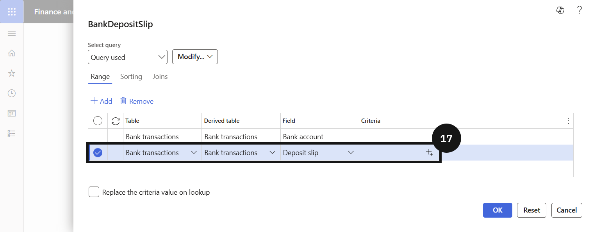

# Cash & Bank

Cash & Bank covers the day-end procedures and bank reconciliation processes required to close out daily transactions accurately. Staff consolidate individual deposit slips created across the day into a single deposit slip by payment method, generate a combined deposit slip report for banking purposes, and verify the resulting entries against the bank account transaction view. These procedures ensure that cash received through counter payments and other channels is correctly recorded and reconciled at the close of each business day.

---

#### Day-End Procedures

The day-end procedure ensures that all cash transactions processed throughout the day are combined into a single deposit slip before being reconciled against the bank statement. Staff access the Customer Payments workspace, consolidate open deposit slips by payment method, and generate a combined deposit slip report for banking. Once the consolidated deposit slip is created, staff can verify the result on the bank account transaction view to confirm the correct amount is reflected.

---

## End of Day Procedure

1. From the **FNO dashboard**, open **Modules** ▸ **Cash and bank management**.
2. Expand **Inquiries and reports** and click **Deposit slips**.
3. Click **Open deposit slips**.

> **Note:** *Open deposit slips shows all individual deposit slips created across the day. Each slip represents a separate cash transaction that has not yet been consolidated.*

4. From the **FNO dashboard**, open **Modules** ▸ **Accounts receivable** ▸ **Workspaces** ▸ **Customer payments**.
5. Click **Consolidate deposit slip**.
6. Enter the **date range** for the consolidation.
7. Expand **Records to include** and click **Filter**.
8. Select the **Method of payment** (e.g., *Cash*).
9. Click **OK**.
10. Click **OK** again to confirm.
11. Return to **Modules** ▸ **Cash and bank management** ▸ **Inquiries and reports** ▸ **Deposit slips**.
13. Locate the consolidated deposit slip for the relevant date.

> **Note:** *The individual open deposit slips for the selected date will no longer appear under Open deposit slips. They are replaced by the single consolidated entry.*

13. Note the **deposit slip number**.
14. Return to **Modules** ▸ **Cash and bank management** ▸ **Inquiries and reports** ▸ **Deposit slips**.
15. Click **Deposit slip reports**.
16. Expand **Records to include** and click **Filter**.
17. Enter the **deposit slip number** in the criteria field.
18. Click **OK** to generate the report.
  > **Note:** *The next steps show the process for viewing the consolidated deposit via the bank account.*
20. From the **FNO dashboard**, open **Modules** ▸ **Cash and bank management**.
21. Click **Bank accounts** and select the relevant **bank account**.
22. Click **Transactions** to verify the deposit.

> **Note:** *The consolidated deposit should appear as a single transaction amount for the day, confirming the end-of-day consolidation has been applied correctly.*

---

#### GEMS Reward Points 

There is a company (GRL) that manages the GEMS reward points. Every payment is posted at the collection school. At day-end, the Finance user must transfer the GEMS reward balance account to the GEMS reward company. 

--- 

## Transfer GEMS Reward Points 

1. Navigate to **Accounts receivable ▸ Payments ▸ Cashier receipt**.  
2. Click **+ Cashier receipt** to create a new journal.  
3. In **Customer payment**, identify the student by their account number. 
4. In **Method of Payment and invoice marking**: 
    - Click **New**. 
    - Select **GEMSPR** as the Method of payment 
    - Enter **Amount** 
    - Enter **Payment reference** 
    - Click **Get GEMS reward points** 
    - Mark the desired Invoice  
5. Click **Post ▸ OK**. 
> **Note:** *For GEMS rewards, the system will automatically update the points for the reward system*. 
6. Navigate to **General ledger ▸ Inquiries and reports ▸ Trial balance**. 
7. Enter: **From date / To date** (today’s date). 
8. Filter: **Main account**, select the ledger account as the method of payment. 
> **Note:** *The transfer balance amount = debit – credit*. 
9. Navigate to **Academic management ▸ Periodic tasks ▸ Transfer GEMS reward balances**. 
10. Enter parameters: 
    - Posting date 
    - From date / To date (same as Trial balance)  
11. Select: 
    - Preview = Yes → Review journal before posting 
    - Preview = No → System auto-creates & posts journal  
12. Click **OK**.
13. The system generates a **journal number**. 
14. Navigate to **General ledger ▸ Journal entries ▸ General journals**. 
15. Click **Lines**. 
16. Validate the journal line. 
    - Account: The system will default the General ledger based on the Method of payment setup. 
    - Offset account: The system will get offset company and the general ledger (setup in Receipt intercompany mapping). 
    - Check that the credit amount = debit – credit. 
17. Click **Post** to post the journal. 

> **Note** *Returning to the trial balance will show that the GEMS reward balance is cleared to zero. The General ledger account will have increased in the GRL company. If this Transfer GEMS reward points process is run on the same date, no data will be generated as there will be no balance.*

---
