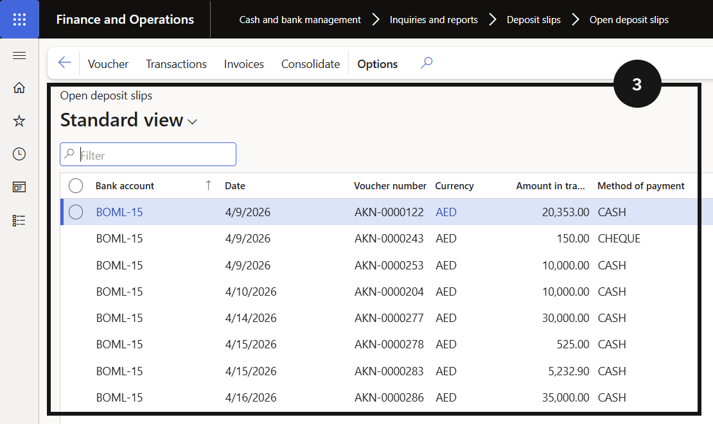
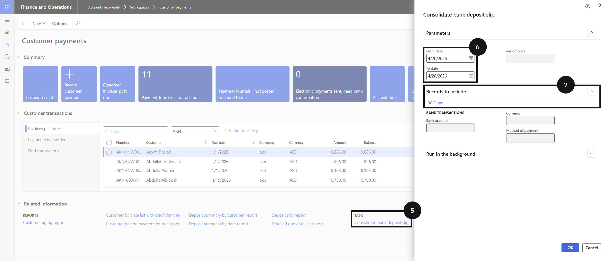
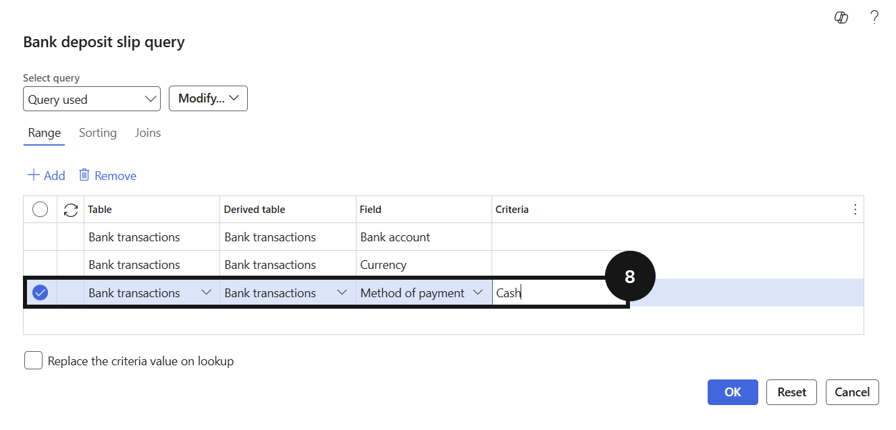
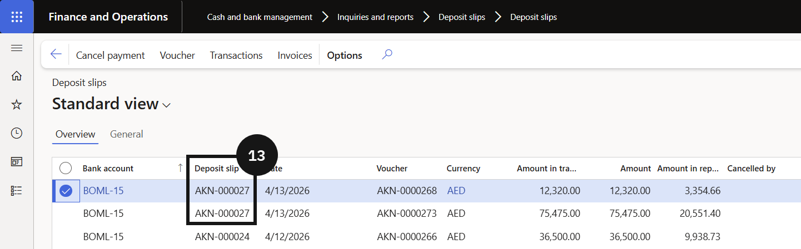

# End of Day Procedure

At the end of each business day, individual deposit slips created across the day are consolidated into a single entry by payment method and a combined deposit slip report is generated for banking purposes. Once consolidated, the deposit is verified against the bank account transaction view to confirm the day's cash is correctly recorded.

1. Review open deposit slips

   From the **FNO dashboard**, open **Modules ▸ Cash and bank management**, expand **Inquiries and reports**, and click **Deposit slips**, then **Open deposit slips**. This shows all individual deposit slips created during the day — each slip represents a separate cash transaction not yet consolidated.

2. Consolidate deposit slips

   Go to **Modules ▸ Accounts receivable ▸ Workspaces ▸ Customer payments** and click **Consolidate deposit slip**. Enter the **date range** for the consolidation, then expand **Records to include** and click **Filter**. Select the **Method of payment** (e.g., *Cash*) and click **OK**, then **OK** again to confirm.

   The individual open deposit slips for the selected date are replaced by a single consolidated entry and will no longer appear under Open deposit slips.

3. Generate the deposit slip report

   Return to **Modules ▸ Cash and bank management ▸ Inquiries and reports ▸ Deposit slips**. Locate the consolidated deposit slip for the relevant date and note the **deposit slip number**.

   Click **Deposit slip reports**, expand **Records to include**, click **Filter**, and enter the **deposit slip number** in the criteria field. Click **OK** to generate the report.

4. Verify the bank transaction

   Open **Modules ▸ Cash and bank management**, click **Bank accounts**, and select the relevant bank account. Click **Transactions** and confirm the consolidated deposit appears as a single transaction amount for the day.

