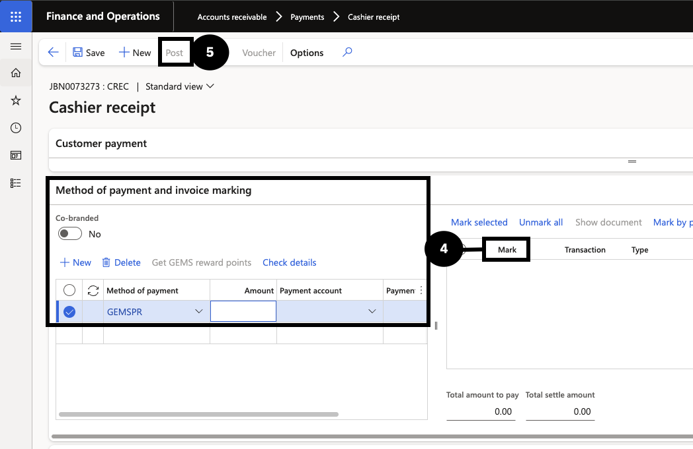
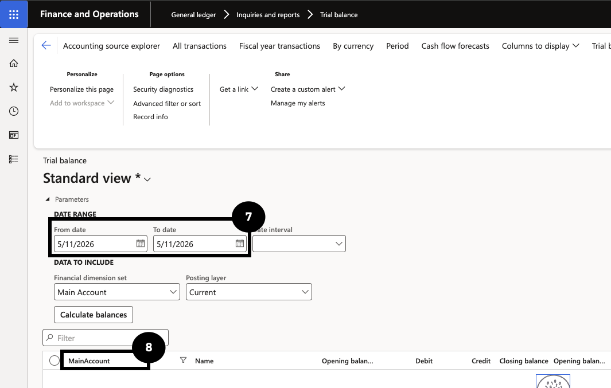
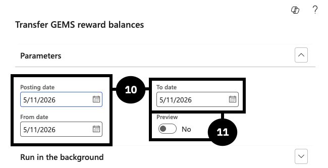

# Transfer GEMS Reward Points

At day-end, the balance of GEMS reward payments collected at the school must be transferred to the GEMS rewards company (GRL). This involves processing the GEMS reward payment in the cashier form, checking the transfer amount on the trial balance, and running the periodic transfer task to move the balance.

1. Process the GEMS reward payment

   From the **FNO dashboard**, open **Modules ▸ Accounts receivable ▸ Payments ▸ Cashier receipt** and click **+ Cashier receipt**. Identify the student by their account number, then complete the payment line:

   - Click **New**.
   - Set **Method of payment** to *GEMS-point*.
   - Enter the **Amount** and **Payment reference**.
   - Click **Get GEMS reward points**, then mark the desired invoice (④).

   Click **Post** (⑤), then **OK**. The system automatically updates the reward points for the GEMS system.

   

2. Determine the transfer amount from the trial balance

   Go to **Modules ▸ General ledger ▸ Inquiries and reports ▸ Trial balance**. Enter today's date as both the **From date** and **To date** (⑦), then filter by **Main account** (⑧) — select the ledger account used as the GEMS-point method of payment. The transfer balance amount = debit − credit.
  
   

3. Run the transfer

   Go to **Modules ▸ Academic management ▸ Periodic tasks ▸ Transfer GEMS reward balances**. Complete the following:

   - **Posting date** — enter the posting date (⑩).
   - **From date / To date** — enter the same dates used in the trial balance (⑩).
   - **Preview** — select *Yes* to review the journal before posting, or *No* to auto-create and post (⑪).

   Click **OK**. The system generates a journal number.

   

4. Validate and post the journal

   Go to **Modules ▸ General ledger ▸ Journal entries ▸ General journals** and open the generated journal. Click **Lines** and validate:

   - **Account** — the system defaults the General ledger based on the Method of payment setup.
   - **Offset account** — the system populates the offset company and General ledger from the Receipt intercompany mapping setup.
   - Confirm the credit amount equals debit − credit from the trial balance.

   Click **Post**. After posting, the GEMS reward balance clears to zero, and the General ledger account in the GRL company increases. Running this process again on the same date will produce no data if there is no remaining balance.
