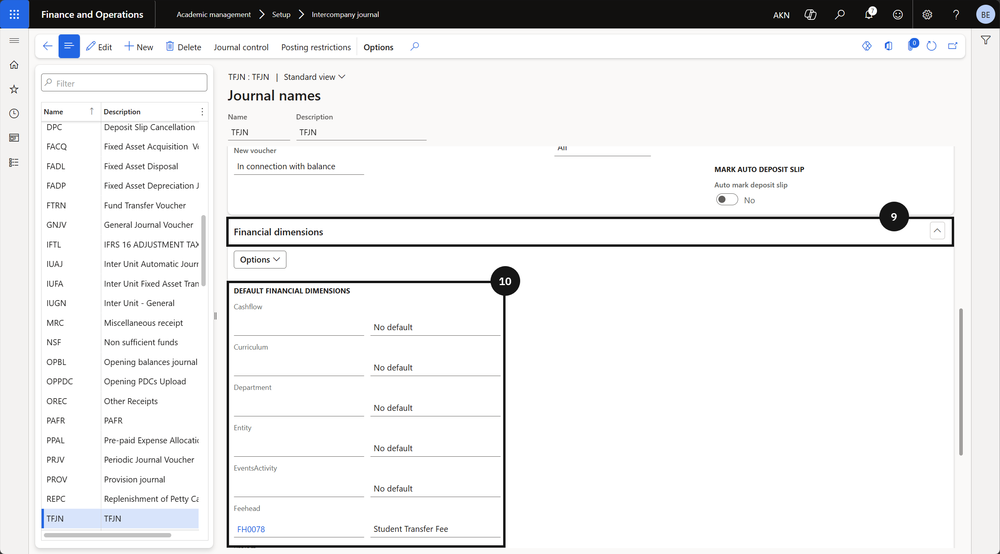

#### Intercompany Transactions

The intercompany transfer process is used when a student moves from one school to another and holds a credit balance in the originating school's system. Finance staff transfer that credit balance to the destination school so it can be applied to the student's account there. Before a transfer can be processed, any advanced tax invoices — such as those raised for application fees or enrolment deposits — must be cancelled, as the system only supports the transfer of net credit balances. The system identifies the student across both schools using a shared global Party ID, and automatically generates paired transfer journals in both the originating and destination schools upon completion. A separate intercompany channel setup in the Academic Management module controls the accounts, journal names, and posting profiles used for these transfer entries.

---

## Prerequisites: Intercompany Channel Setup

> **Note:** *This setup must be completed in both the originating school and the destination school before any credit balance transfer can be processed.*

1. From the **FNO dashboard**, open **Modules** ▸ **Academic Management**.
2. Expand **Setup** and click **Intercompany journal**.
3. Click **New**.
4. Select the **Originating company**.
5. Enter the **Credit account** to be used as the control account for the transfer from the originating school.

   > **Note:** *For the originating school, the transfer posts to the credit side. For the destination school, the transfer posts to the debit side.*

6. Enter the **Journal** for the originating company.
7. Enter the **Posting profile** to be used for the transfer transactions.
8. Click on the **Journal** name.
9. Open **Financial dimensions** tab.
10. Enter the **fee head** or financial dimensions to be defaulted on the transfer journal.

   > **Note:** *Financial dimensions set here are applied automatically to the transfer voucher. This controls how the transfer is reported against fee heads or cost centres.*

11. Repeat steps 4-10 for the destination company.
12. Click **Save**.
13. Click **Back**.
14. Click **Save**.

---

## Transfer Customer Credit Balance

> **Note:** *Before transferring, confirm that the student exists in the destination school and that the Party ID (global ID) is identical in both the originating and destination school. The system uses the Party ID to match the student account across companies. The student account number may differ between schools.*

1. From the **FNO dashboard**, open **Modules** ▸ **Academic Management**.
2. Expand **Students** and click **All Students**.
3. Search for and open the **student record**.
4. Expand **Other Information**.
5. Verify the **Destination school** field has been populated by the CE system.

   > **Note:** *The CE system updates the Destination school field in the student master automatically when a transfer is initiated. This field identifies which company the credit balance will be transferred to.*

6. Open **Academic** in the toolbar.
7. Click **Transfer**.
    > **Note:** _Confirm the student's balance is in **credit** and that no advanced tax invoices remain outstanding before transferring._
8. Review the credit balance displayed in the confirmation dialog.
9. Click **OK** to confirm the transfer.

   > **Note:** *The system automatically generates two transfer journals — one in the originating school to clear the student's credit balance, and one in the destination school to post the corresponding credit to the student's account there.*

---

## Intercompany Transaction in case of Monthend Fee Concession Transfers
