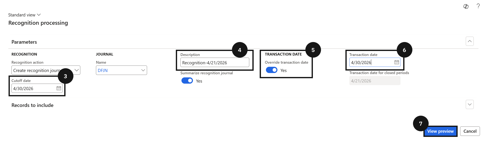
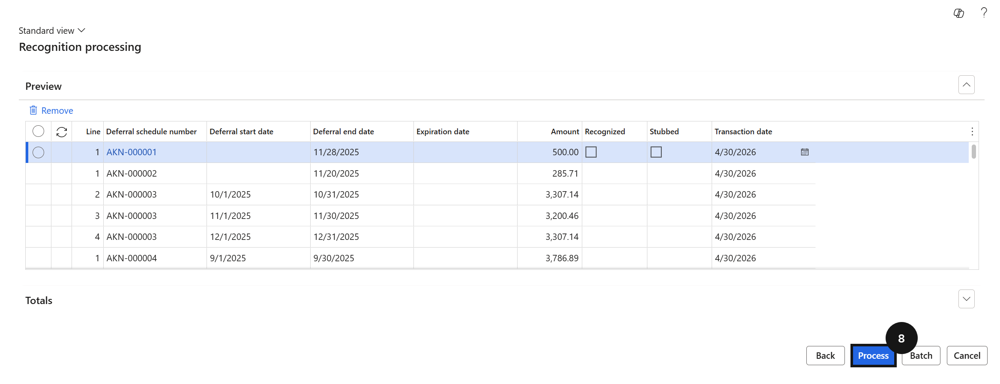
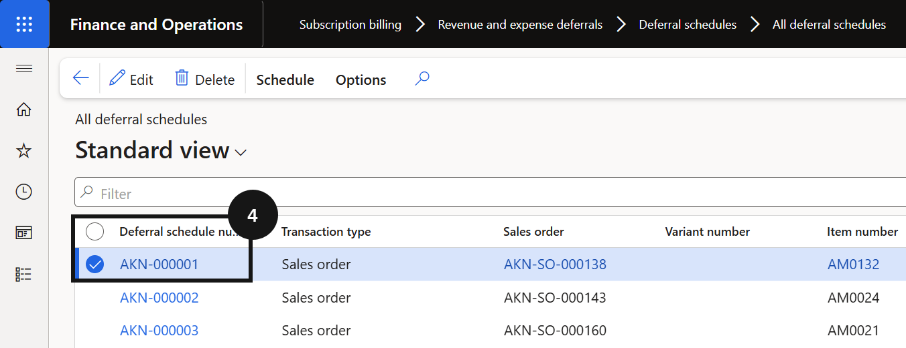
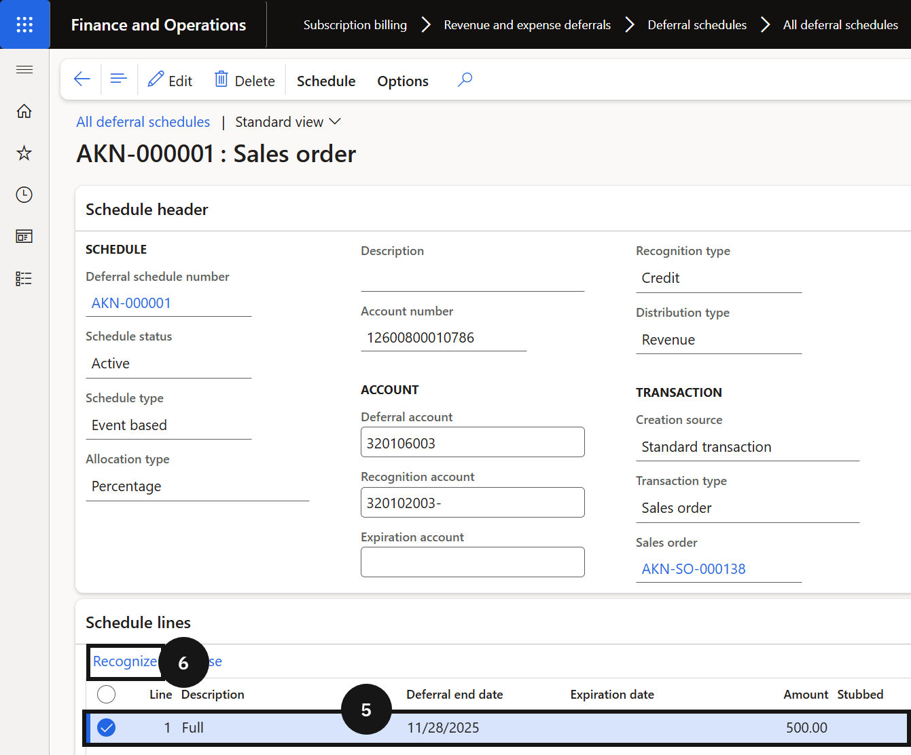
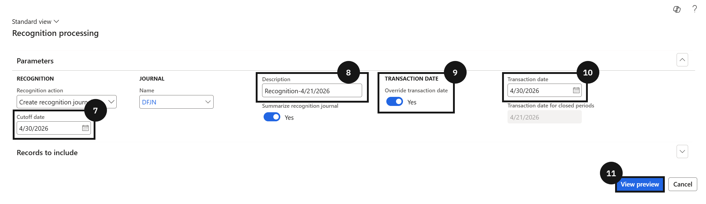
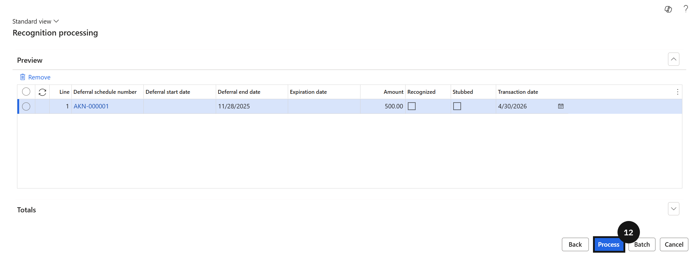

# Revenue Recognition

Revenue Recognition manages the month-end process of recognising deferred revenue in line with the school's billing and deferral schedule configuration. It allows finance staff to run recognition processing across all eligible deferral schedules for a given period using the Periodic tasks batch process, or to process recognition for a single invoice directly from the Deferral schedules list. Correct configuration of cutoff dates and transaction dates ensures that revenue is posted to the appropriate general ledger accounts for the period being closed.

---

#### Month End Processing

Month-end processing in GEMS covers the tasks required to close out a financial period accurately. Revenue recognition is performed at the end of each month to ensure that deferred revenue is posted to the correct general ledger accounts in line with the school's billing and deferral schedule configuration. Staff can run recognition across all eligible schedules using the Periodic tasks batch process, or target a single invoice directly from the Deferral schedules list.

---

## Revenue Recognition Processing

1. From the **FNO dashboard**, open **Modules** ▸ **Subscription billing** ▸ **Revenue and expense deferrals**.
2. Expand **Periodic tasks** and click **Recognition processing**.
3. In the **Cutoff date** field, enter the last day of the month.
4. In the **Description** field, enter a value.
5. In the **Override transaction date** field, select *Yes*.
6. In the **Transaction date** field, enter the last day of the month.

> **Note:** *The Cutoff date and Transaction date should both be set to the last day of the month being closed. Setting Override transaction date to Yes ensures the journal posts with the correct period date regardless of when the process is run.*

7. Click **View preview**.

> **Note:** *The preview lists all deferral schedule lines that will be recognised up to the cutoff date. Review this list before posting to confirm the entries are correct.*

8. Click **Process** to post the revenue recognition journal.

---

## Recognise a Specific Invoice

1. From the **FNO dashboard**, open **Modules** ▸ **Subscription billing** ▸ **Revenue and expense deferrals**.
2. Expand **Deferral schedules** and click **All deferral schedules**.
3. Locate and select the posted invoice.
4. Click the **deferral number** to open the schedule.
5. Select the **Line**.
6. Click **Recognize**.
7. In the **Cutoff date** field, enter the last day of the month.
8. In the **Description** field, enter a value.
9. In the **Override transaction date** field, select *Yes*.
10. In the **Transaction date** field, enter the last day of the month.
11. Click **View preview**.
12. Click **Process**.

> **Note:** *After posting, click **Audit trail** to verify the journal entry was posted, then click **Voucher transaction** to review the posted voucher.*

---
