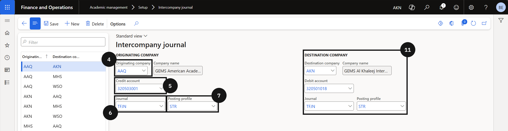
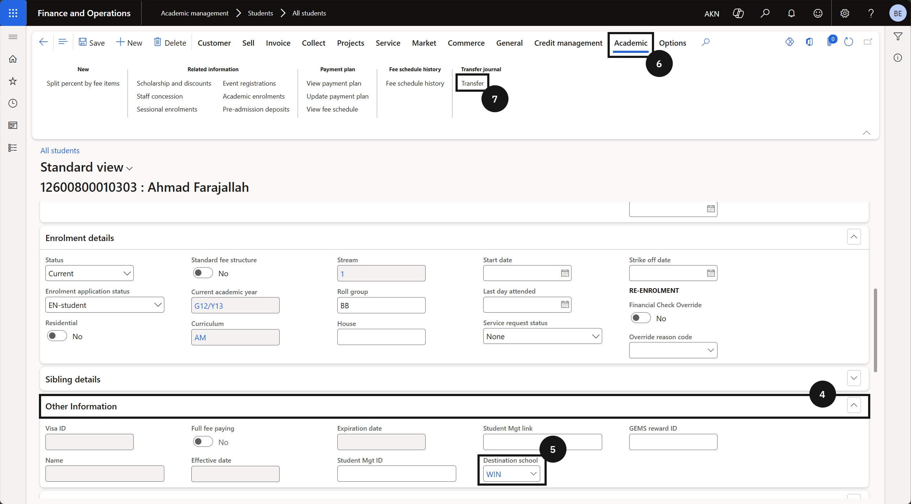

#### Intercompany Transactions

The intercompany transfer process is used when a student moves from one school to another and holds a credit balance in the originating school's system. Finance staff transfer that credit balance to the destination school so it can be applied to the student's account there. Before a transfer can be processed, any advanced tax invoices — such as those raised for application fees or enrolment deposits — must be cancelled, as the system only supports the transfer of net credit balances. The system identifies the student across both schools using a shared global Party ID, and automatically generates paired transfer journals in both the originating and destination schools upon completion. A separate intercompany channel setup in the Academic Management module controls the accounts, journal names, and posting profiles used for these transfer entries.

---

## Prerequisites: Intercompany Channel Setup

> **Note:** *This setup must be completed in both the originating school and the destination school before any credit balance transfer can be processed.*

1. From the **FNO dashboard**, open **Modules** ▸ **Academic Management**.
2. Expand **Setup** and click **Intercompany channel setup**.
3. Select the **originating school company**.
4. Enter the **credit account** to be used as the control account for the transfer from the originating school.

   > **Note:** *For the originating school, the transfer posts to the credit side. For the destination school, the transfer posts to the debit side.*

5. Enter the **transfer journal name** for the originating company.
6. Enter the **posting profile** to be used for the transfer transactions.
7. Enter the **fee head** or financial dimensions to be defaulted on the transfer journal.

   > **Note:** *Financial dimensions set here are applied automatically to the transfer voucher. This controls how the transfer is reported against fee heads or cost centres.*

8. Click **Save**.
9. Switch to the **destination school company**.
10. Repeat steps 3–8 for the destination school, entering the destination school's **debit account**, **journal name**, **posting profile**, and **financial dimensions**.

---

## Cancel Advanced Tax Invoice

> **Note:** *All advanced tax invoices (e.g., application fees, enrolment deposits) must be cancelled before a credit balance transfer can proceed. The CE system triggers this cancellation automatically via integration when ready; in the interim, cancellations are performed manually using the steps below.*

1. From the **FNO dashboard**, open **Modules** ▸ **Academic Management**.
2. Expand **Students** and click **All Students**.
3. Search for and open the **student record**.
4. Navigate to the **Readmission fees** table.
5. Locate the **advanced tax invoice** to be cancelled (e.g., application fee or enrolment deposit).
6. Select the **invoice line**.
7. Click **Cancel** to reverse the advanced tax invoice.

   > **Note:** *Once cancelled, the system generates a reversal transaction. Refresh the student's transaction view to confirm the reversal has posted before proceeding to the transfer.*

8. Click **Refresh** to verify the reversal transaction has been generated.

---

## Transfer Customer Credit Balance

> **Note:** *Before transferring, confirm that the student exists in the destination school and that the Party ID (global ID) is identical in both the originating and destination school. The system uses the Party ID to match the student account across companies. The student account number may differ between schools.*

1. From the **FNO dashboard**, open **Modules** ▸ **Academic Management**.
2. Expand **Students** and click **All Students**.
3. Search for and open the **student record** in the originating school.
4. Verify the **Destination school** field has been populated by the CE system.

   > **Note:** *The CE system updates the Destination school field in the student master automatically when a transfer is initiated. This field identifies which company the credit balance will be transferred to.*

5. Click the **Transactions** tab to review the student's current balance.
6. Confirm the student's balance is in **credit** and that no advanced tax invoices remain outstanding.
7. Click **Transfer balance**.
8. Review the credit balance displayed in the confirmation dialog.
9. Click **OK** to confirm the transfer.

   > **Note:** *The system automatically generates two transfer journals — one in the originating school to clear the student's credit balance, and one in the destination school to post the corresponding credit to the student's account there.*

10. Switch to the **destination school company**.
11. Open **Modules** ▸ **General Ledger** ▸ **Journal entries** ▸ **General journals**.
12. Filter by the **transfer journal name** to locate the generated transfer journal.
13. Verify the transfer transactions have posted correctly in both the originating and destination school.

