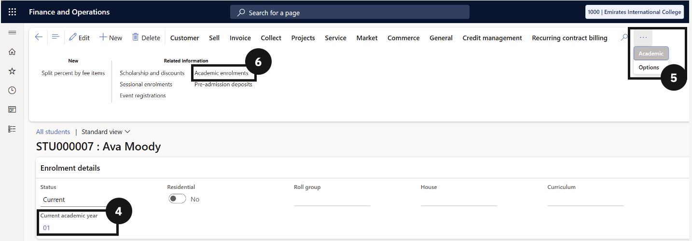
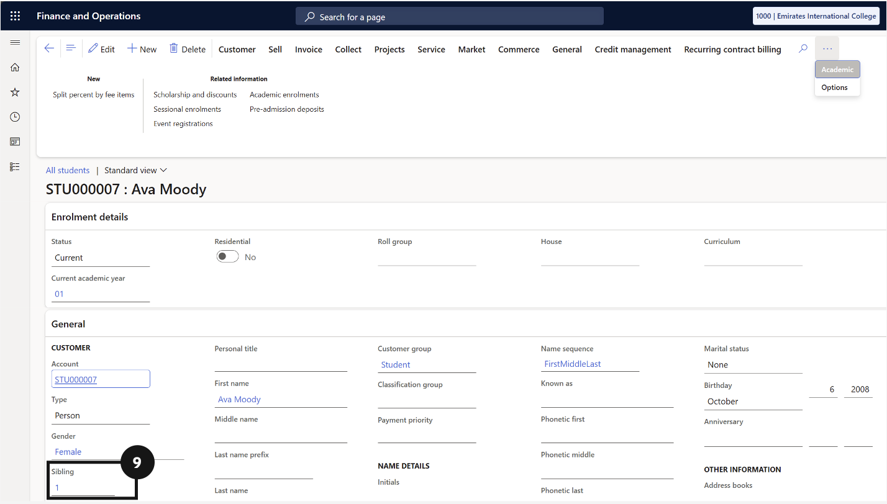

# Generate Fees

This section walks through everything required to generate accurate fee invoices for students. It covers verifying student master data, setting up scholarships and discounts, configuring subject and event names, building fee schedule templates, and running the batch process to generate and post invoices. It also includes reconciling generated sales orders to confirm accuracy before posting.

---

#### Check Student Master Data
Accurate fee generation depends entirely on the quality of the data held against each student's record. Before running any fee batch, it is essential to verify that each student has the correct academic year assigned, that their enrolment effective and expiration dates are current, that sibling order numbers are set for students eligible for family discounts, and that the financial responsibility percentages across all fee payers add up to 100. Any gaps or errors in this data at this stage will flow through to the invoices generated, making it significantly harder to correct after the fact.

---

## Check Student Details

1. From the **FNO dashboard**, open **Modules** ▸ **Academic Management**.
2. Expand **Students** and click **All students**.
3. Click on a **student**'s name to retrieve their details.
4. Confirm the Current academic year under Enrolment details and update if needed.
5. Open the **Academic** tab in the top toolbar.
6. Click on **Academic enrolments** under Related information.
7. Confirm the **Effective date** and **Expiration date** and update if needed.
8. Click **Back** in the top toolbar.
9. If the student has siblings, confirm the Sibling field under General has a number (e.g., eldest sibling = 1).
10. In the Relationships section, ensure the total **Paid percentage equals 100.00**.
11. Click **Save** if any changes were made.

---

---

---

---

## Reconcile the Generated Sales Orders

1. From the **FNO dashboard**, open **Modules** ▸ **Academic Management**.
2. Expand **Fee schedule batches** and select **All fee schedule batches**.
3. Click the relevant **Fee schedule batch number** to view details.
4. Open **Fee generation reconciliation report** to check:
   - How many fee payer accounts were included.
   - How many students were included.
5. To export data, right-click the **Fee payer name** column header and select **Export all rows**.
6. In the dialog, click **Download** to export to Excel or SSRS for further validation if needed.

---

#### Post Fee Invoice and Settle Deposit
After fee invoices have been generated and reviewed, they need to be formally posted to create the financial transactions in the system. This is done by selecting the relevant fee schedule batch and initiating the post, either directly or as a background job for large volumes. Once posted, the batch status updates from Active to Invoice. At this point, the system also automatically matches any received enrolment deposits to the corresponding invoices, settling them against the posted amounts. Staff should confirm that deposit statuses update from Received to Settled to ensure the reconciliation has completed correctly.

---

## Post Fee Invoices

1. From the **FNO dashboard**, open **Modules** ▸ **Academic Management**.
2. Expand **Fee schedule batches** and click **All fee schedule batches**.
3. Click on the **Fee schedule batch number** you want to post (status must be Active).
4. Click **Post** in the toolbar.
5. Choose the **Posting date** (e.g., end of June).
6. Decide whether to:
   - Post directly, or
   - Run as a background job (recommended for large batches).
7. If running in the background, submit and wait for processing.
8. When complete, the batch status changes from Active to Invoice, and invoices are generated.

---

## Settle Enrolment Deposits

1. From **Modules** ▸ **Academic Management ▸ Inquiries and reports** ▸ **Pre-admission fees**.
2. Click **Pre-admission deposits**.
3. Click **OK** in the dialog.
4. Click on the enrolment deposit **Sales order** you want to review.
5. Review deposits with status **received** (indicating payment).
6. After posting, the system automatically matches these deposits to invoices.
7. Confirm the deposit status changes from received to **settled**.

---
