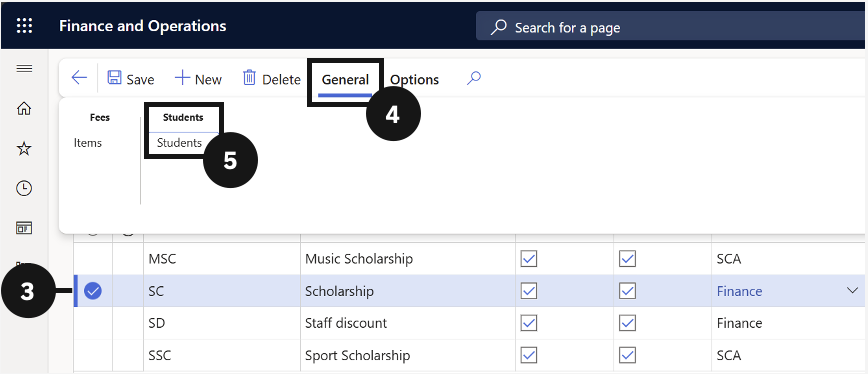
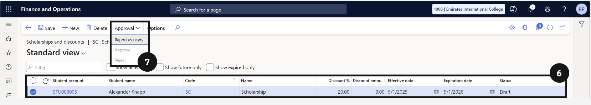
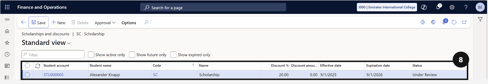

# Scholarships and Discounts

This section explains how to create and manage financial reductions applied to student fees. It covers creating new scholarships and discounts, linking them to specific fee items and student records, managing the approval workflow from Draft through to Approved, and viewing applied discounts against student invoices and fee schedule batches.

---

#### Manage Scholarships and Discounts
Scholarships and discounts allow the school to apply financial reductions to individual students' fees in a controlled and auditable way. The process involves creating the scholarship or discount record, linking it to the specific fee items it applies to, and then assigning it to the relevant students with the appropriate percentage or amount and a defined active date range. Before a discount takes effect on an invoice, it must go through an approval workflow, moving from Draft to Under Review and finally to Approved. This ensures that all discounts are properly authorised before they impact a student's billing.

---

---

## Linking Scholarships and Discounts to Fee Items

1. From the **FNO dashboard**, open **Modules** ▸ **Academic Management**.
2. Expand **Setup** and click **Scholarships and discounts**.
3. Select a **scholarship or discount** by checking the circle to the left of the item.
4. Click **General** in the toolbar.
5. Choose **Items** under the Fees tab.
6. Click **New** to create a new item.
7. Enter the required details.
8. Click **Save**.

---

## Linking Scholarships and Discounts to Students

1. From the **FNO dashboard**, open **Modules** ▸ **Academic Management**.
2. Expand **Setup** and click **Scholarships and discounts**.
3. Select a **scholarship or discount** by checking the circle to the left of the item.
4. Click **General** in the toolbar.
5. Choose **Students** under the Students tab.
6. Click **New** to create a new record.
7. Complete the following columns to link a scholarship or discount to a student:
   - Choose a student from the **Student Account** dropdown.
     *Note: The Student Name, Code, and Scholarship/Discount Name will prepopulate.*
   - Choose whether to apply a **percentage or total discount** amount.
   - Set the **start and expiration date**.
8. Click **Save**.

---

## Scholarship and Discount Approval Process

1. From the **FNO dashboard**, open **Modules** ▸ **Academic Management**.
2. Expand **Setup** and **click Scholarships and discounts**.
3. Select a **scholarship or discount** by checking the circle to the left of the item.
4. Click **General** in the toolbar.
5. Choose **Students** under the Students tab.
6. Select the **student record** in Draft status that requires approval.
7. Click the **Approval dropdown** in the toolbar and choose **Report as ready**.
8. The status changes to Under Review.
9. Click **Save**.

---

## Approving or Rejecting Scholarships and Discounts

1. From the **FNO dashboard**, open **Modules** ▸ **Academic Management**.
2. Expand **Setup** and click **Scholarships and discounts**.
3. Select a **scholarship or discount** by checking the circle to the left of the item.
4. Click **General** in the toolbar.
5. Choose **Students** under the Students tab.
6. Select the student whose **scholarship/discount requires approval**.
7. Click the Approval dropdown and choose **Approve or Reject**.
8. Click **Save**.

---

## View Scholarships and Discounts for a Student

1. From the **FNO dashboard**, open **Modules** ▸ **Academic Management**.
2. Expand **Students** and click **All Students**.
3. Search for and select the **student**.
4. Click the **Academic tab** in the toolbar.
5. Under Related information, click **Scholarship and discounts**.
6. Use the **checkbox to filter by activity**.

---

## View Approved Scholarship and Discount Fees

1. From the **FNO dashboard**, open **Modules** ▸ **Academic Management**.
2. Expand **Fee schedule batches** and click **All fee schedule batches**.
3. Search for the **fee record** you want to view.
4. Open the **fee record**.
5. Under Sales order lines, scroll to the right to view the **discount amount** applied.

---
