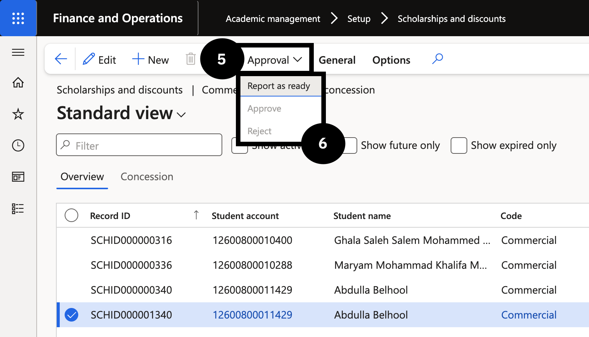
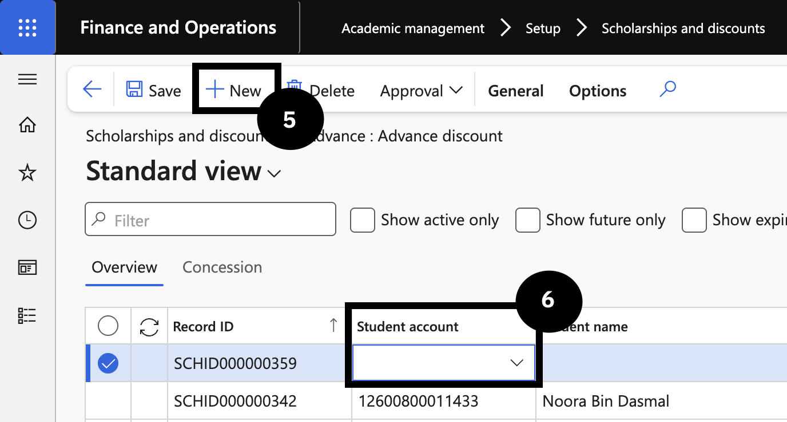
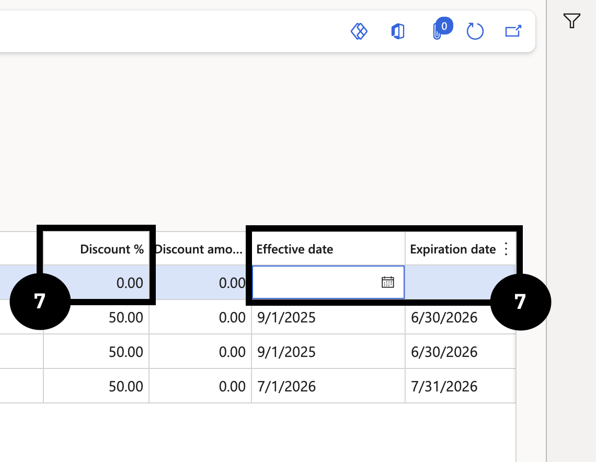
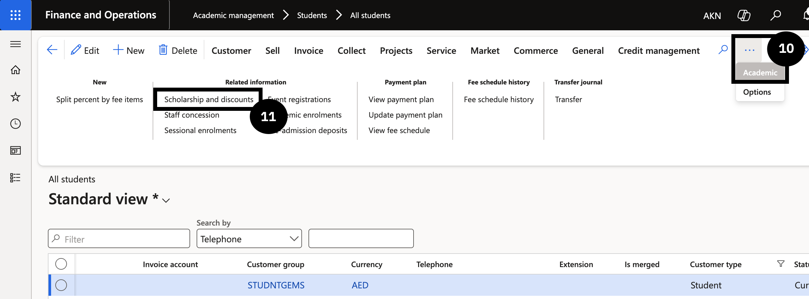

## Post Fee Invoices

1. Navigate to **Modules ▸ Academic Management ▸ Students ▸ All students**.
2. Open the **Account** column filter.
3. Enter the student’s account number in the **Account** field using the *contains* filter operator, then click **Apply**.

   
4. Click **Sell** in the toolbar.
5. Expand **Orders** in the **Action Pane** and click **All sales orders** to locate the open proforma invoice.

6. Click on the link in the **Sales** column for sales order details.
   > **Note:** *The status of the sales order must be **open** to complete the next steps.*

7. Copy the sales order number from the header.

8. Close the page.
9. Navigate to **Modules ▸ Academic Management ▸ Periodic Tasks ▸ Post sales order invoice**.
10. Expand **Records to include**.
11. Click **Filter**.

12. Click the empty **Criteria** cell in the column to the right of **Sales order**.
13. Enter the sales order number copied earlier into the **Sales order** field using the *begins with* filter operator.

14. In **Period name**, select the term you want to invoice for and click **OK**.

15. To separate into an itemised invoice, select **Yes** in the **Split invoice by item** field.
16. Enter a date in the **Posting date** field, then click **OK**.

17. Return to **Modules ▸ Academic Management ▸ Students ▸ All students**.
18. Open the **Account** column filter.
19. Enter the student’s account number in the **Account** field using the *contains* filter operator.
20. Click **Orders ▸ All sales orders**.
21. Click on the link in the **Sales** column of the selected row.
22. On the **Action Pane**, select **Invoice**.
23. Under **Journals**, click **Invoice**.

24. Find and select the desired invoice.
25. Expand **View**, then select **GEMS VAT invoice**.

---

## Scholarship and Discount Approval Process

1. Navigate to **Modules ▸ Academic Management ▸ Setup ▸ Scholarships and discounts**.
2. Select **Commercial concession**.
3. Click **General** in the Action Pane.
4. Select **Students**.

5. Select the student record, then expand **Approval** in the Action Pane.
6. Select **Report as ready**.
   > **Note:** *The report status will update to Under Review. The record will move to the Approver user group for approval.*

---

## Linking Scholarships and Discounts to Students

1. Navigate to **Modules ▸ Academic Management ▸ Setup ▸ Scholarships and discounts**.
2. Select **Commercial concession**.
3. Click **General** in the Action Pane.
4. Select **Students**.
5. Click **New** to add a new detail.
6. In the **Student account** field, select the relevant student from the dropdown.

7. Complete the **Discount %**, **Effective date**, and **Expiration date** fields.

8. Navigate to **Modules ▸ Academic Management ▸ All students**.
9. Select the newly added student record.
10. Click **Academic** in the Action Pane.
11. Under **Related information**, select **Scholarships and discounts** to view the record.

---
