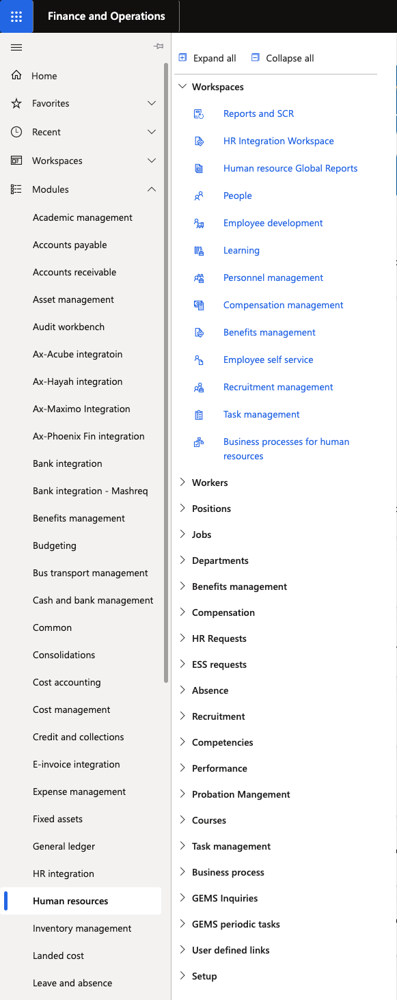

# Sign in to Dynamics 365 HR

D365 HR uses your GEMS Microsoft 365 account — the same login you use for email.

1. Open the D365 HR portal

   Navigate to the D365 HR URL. Your system administrator will have provided this link.

2. Sign in with Microsoft

   Click **Sign in** and enter your **GEMS Microsoft 365** email address and password. If your organisation uses single sign-on (SSO) and you are already signed into Microsoft on this device, you will be signed in automatically.

   

3. Open Human Resources

   Once on the D365 home page, click the **hamburger menu (☰)** on the left, select **Modules**, and click **Human Resources** to begin.

   
