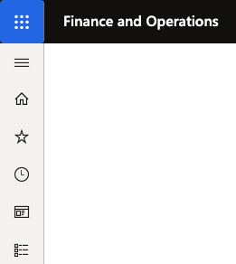
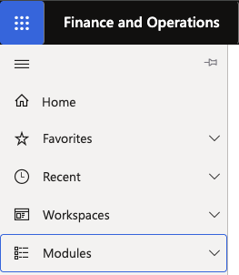
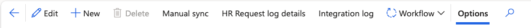

# Navigate Dynamics 365 HR

1. Open the navigation pane

   Click the **hamburger menu (☰)** at the top-left of the screen to expand the full navigation menu.

   

2. Go to a module

   Click **Modules** to see all available functional areas — including **Human Resources**, **Employee Self Service**, and others relevant to your role. Click into a module, then expand its submenus to find the page you need.

   

   > **Note:** You can search for any module, form, or page directly using the **search bar** at the top of the screen. To return to your home page at any time, click the **Home** icon in the navigation pane.

3. Use the Action Pane

   When you open a record — such as an employee profile, a visa record, or a questionnaire — a toolbar called the **Action Pane** appears at the top of the page. Three buttons are always present regardless of which record you are viewing:

   | Button | What it does |
   |---|---|
   | **Back** | Returns you to the previous page or list view |
   | **Save / Edit** | Toggles between edit mode and saving your changes |
   | **New** | Creates a new record |

   

   These buttons stay anchored in place as you move through tabs and sections within a form.
