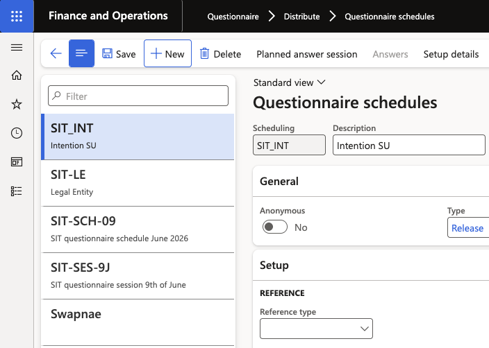
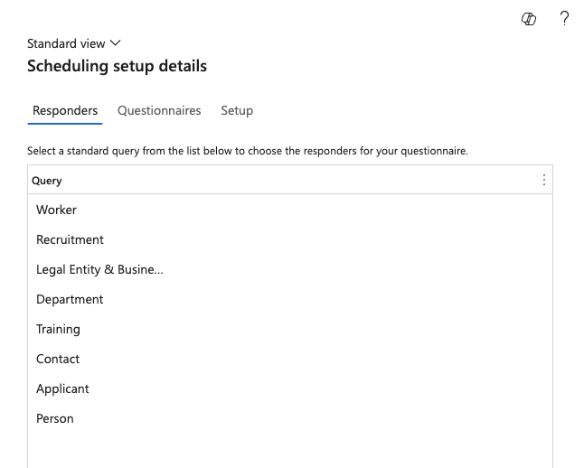
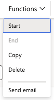

# Set up a questionnaire schedule

Questionnaire schedules target a questionnaire to specific employees across one or more legal entities. Schedules are typically created in the GCO entity and can be released to individual schools or across all companies.

1. Open the Questionnaire module

   From the D365 navigation pane, go to **Modules ▸ Questionnaire ▸ Distribute ▸ Questionnaire schedules**.

2. Create a new schedule

   Click **Questionnaire schedules** in the left menu, then click **New**.

   

3. Select the questionnaire

   In the **Questionnaire** field, select the questionnaire to distribute. The questionnaire must already exist in the system before it can be scheduled.

4. Target the audience

   Set the **Legal entity** (or select multiple companies or business segments) to specify which school or group of schools the questionnaire is released to. Leave this global if it applies to all entities.

   

5. Set the date range

   Enter a **Start date** and **End date** for the questionnaire window. Respondents will only see the questionnaire within this active period.

6. Start the schedule

   Click **Start** to activate the schedule. The questionnaire will appear for targeted employees in the ESS portal under their **Questionnaires** tab.

   
