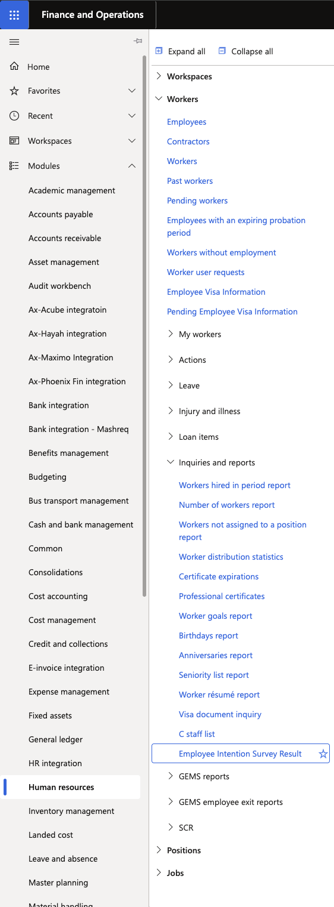
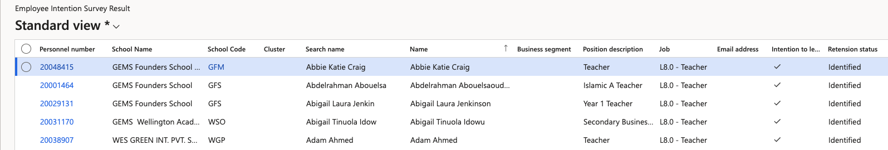

# View the intentions inquiry

The Employee Intention Survey Result form displays all employees who answered "Yes" to the intention-to-leave question in the Intention Questionnaire. Responses are captured live as employees submit the survey through ESS.

1. Navigate to the intentions inquiry

   From the D365 navigation pane, go to **Human Resources ▸ Workers ▸ Inquiries and Reports ▸ Employee Intention Survey Result**.

   

2. Review the list

   The form displays all flagged employees. Columns include: name, search name, school, school code, business segment, position, job, email, intention to leave response, and retention status.

   The list is pre-loaded with historical data and receives new live submissions as employees complete the questionnaire. You can build filters to segment employees by retention status stage or school.

   

3. Open a record

   Click on an employee's record to open the full detail view, including their questionnaire response and current **Retention Status**.
