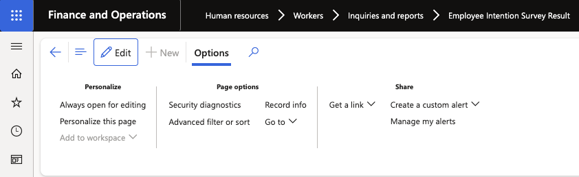
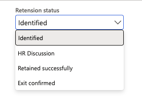

# Update an employee's retention status

As your retention conversation with an employee progresses, update their status in the Intentions Inquiry to keep the record up to date.

1. Open the intentions inquiry

   Navigate to **Human Resources ▸ Workers ▸ Inquiries and Reports ▸ Employee Intention Survey Result** and locate the employee.

2. Edit the record

   Click **Edit** to put the record into edit mode. Most fields are read-only. Only the **Retention Status** and **Comments** fields are editable.

   

3. Update the retention status

   Select the appropriate status from the **Retention Status** dropdown:

   | Status | When to use |
   |---|---|
   | **HR Discussion** | A retention conversation has been initiated |
   | **Retained successfully** | The employee has agreed to remain |
   | **Exit confirmed** | The employee is confirmed as leaving — triggers the recruitment process |

   

4. Add a comment

   Enter any relevant notes in the **Comments** field to document the outcome of conversations or actions taken.

5. Save

   Click **Save** to record the change.
