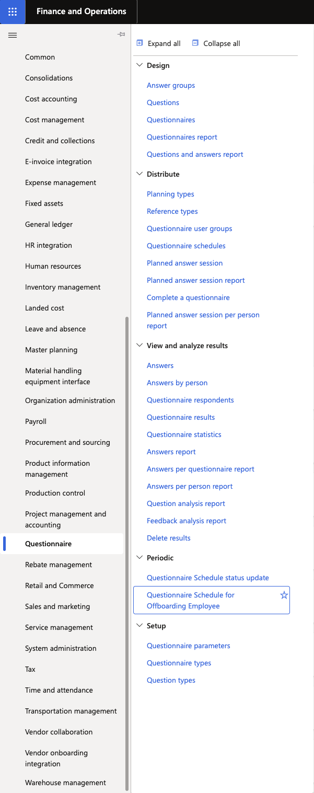
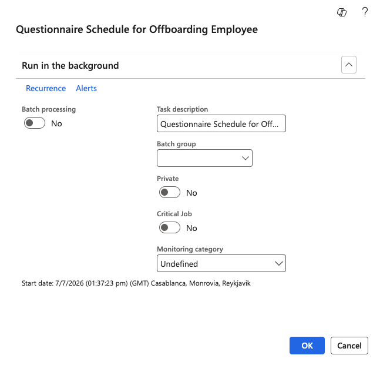

# Run the offboarding questionnaire batch

The offboarding exit survey is generated automatically via a batch job that detects employees assigned an offboarding checklist. Run this batch to assign the exit questionnaire to departing employees.

1. Navigate to the questionnaire schedule

   From D365, go to **Question Model ▸ Question Schedule** and locate the schedule named **Offboarding Employees** (or equivalent).

   

2. Run the schedule

   Click **Run** (or **Re-run**) to trigger the batch job. The job:
   - Finds all employees who have been assigned an offboarding checklist.
   - Generates a questionnaire for each employee based on the offset dates defined in the checklist.
   - Assigns the questionnaire to each employee for completion in ESS.

   

   > **Note:** This batch can be configured to run nightly as a recurring job — no manual intervention is required once scheduled. Run it manually only when you need to trigger it outside the normal cycle.

3. Confirm generation

   After the batch runs, a questionnaire ID is generated for each affected employee. Employees will see the questionnaire appear in their ESS portal under the **Questionnaires** tab.
