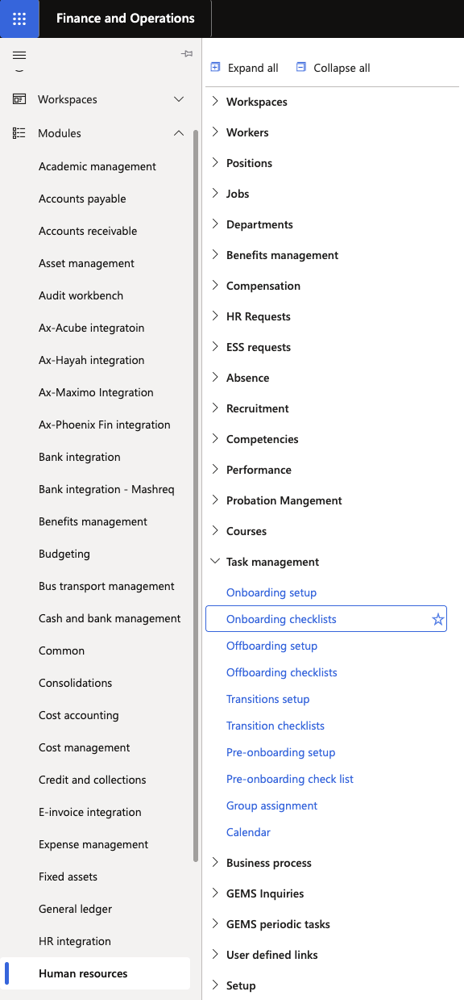
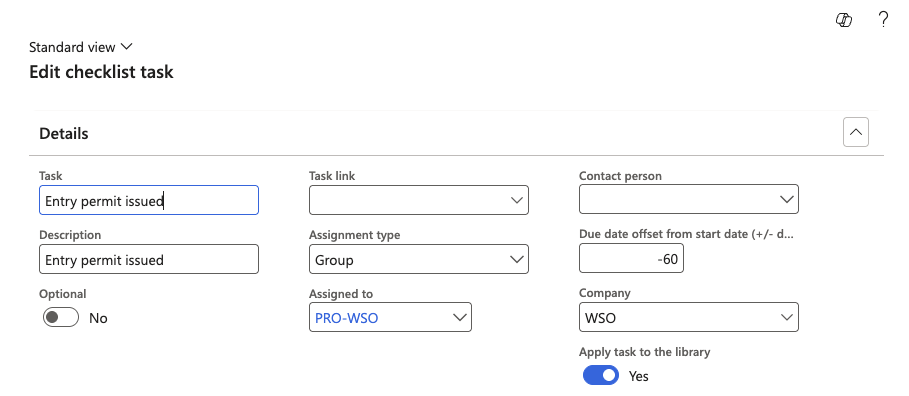
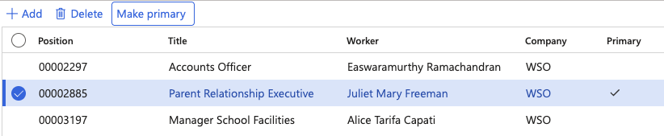

# Configure an onboarding checklist

Onboarding checklists define the tasks assigned to a new employee and their supporting teams upon joining the organisation. Tasks can be assigned to a specific person, a user group, or left for manual assignment at the time of hire.

1. Open Onboarding checklists

   From the D365 navigation pane, go to **Modules ▸ Human Resources ▸ Task Management ▸ Onboarding checklists**.

   

2. Select or create a checklist

   Select an existing checklist to modify, or click **New** to create one.

3. Edit the checklist

   Click **Edit** to enter edit mode. For each task, configure:
   - **Task** name and description
   - **Assigned to** — a specific person, a user group, or left blank for manual assignment at hire
   - **Due date offset from start date** — the due date, calculated as a number of days relative to the employee's start date

   

4. Assign to a group

   If using a group assignment, right-click to **View Details** to see its members filtered by legal entity. Select one member and click **Make Primary** — tasks route to the primary only, not all group members. If the primary has an active delegation configured, the delegated person automatically receives the task.

   

5. Save

   Click **Save** to apply the configuration.
